# Fabrik3DLite

Fabrik3DLite is a modular industrial software prototype built around a robotic machining cell. The repository combines a 3D simulator, an orchestration backend, and a dedicated HMI client to explore how an industrial operator interface, a machine simulation, and a task manager can work together.

The project is designed first as an educational and prototyping environment: it helps model a robot + CNC workflow, visualize machine behavior, and progressively evolve toward a more realistic industrial software stack.


Animated machining workflow:


## Vision

The original idea behind Fabrik3DLite is to simulate a small automated machining cell in a way that remains understandable for students, demonstrable for presentations, and extensible for more advanced industrial scenarios.

The long-term goal is not just a 3D animation. It is a full solution where:

- an operator interacts with a dedicated HMI
- a simulator executes the cell behavior visually
- a central backend orchestrates jobs, sessions, machine states, alarms, and messages
- each part communicates through explicit application contracts

Today, the repository already contains the foundation for that architecture.

## What The Solution Contains

The solution currently includes:

- a **3D simulator client** built with Vue 3, TypeScript, and Three.js
- a **server-orchestrator** built with ASP.NET Core, MongoDB, Swagger, and SignalR
- shared backend layers:
  - **Contracts**
  - **Domain**
  - **Infrastructure**
- a separate **HMI client** built with Vue 3, TypeScript, Bootstrap, vue-router, vue-i18n, and SignalR

At a high level, the system models a pallet-based machining scenario:

1. a pallet arrives in the simulated work area
2. the robot picks a raw part from a pallet slot
3. the robot loads the part into the CNC
4. the CNC performs machining
5. the robot retrieves the part
6. the robot returns the machined part to the original pallet slot

## Main Features

### Simulator

- 3D robotic cell rendering with Three.js
- industrial robot model with articulated joints
- CNC machine model and CNC door/machining cycle behavior
- pallet conveyor flow and raw material pallets
- pallet-to-CNC-to-same-pallet workflow
- local operator dashboard for runtime monitoring
- progressive integration with the backend orchestrator

### Server-Orchestrator

- job and task lifecycle management
- simulation session tracking
- machine state persistence
- alarm and operator message APIs
- MongoDB persistence
- REST API documented via Swagger
- SignalR hub for real-time orchestration events

### HMI

- dedicated operator interface separate from the simulator
- multi-view structure inspired by industrial touch HMIs
- multilingual setup:
  - English
  - German
  - French
- job list, current job, messages, alarms, settings, and home dashboard views
- Bootstrap-based, scalable, industrial-style interface

## Solution Architecture Overview

The repository is organized as one solution with multiple focused projects:

```text
Fabrik3DLite/
├─ README.md
├─ media/
├─ Fabrik3D/
│  ├─ fabrik3d.client/         # 3D simulator
│  ├─ fabrik3d.hmi/            # Operator HMI
│  ├─ Fabrik3D.Server/         # Orchestration backend
│  ├─ Fabrik3D.Contracts/      # Shared DTOs, enums, events
│  ├─ Fabrik3D.Domain/         # Domain entities and mapping
│  ├─ Fabrik3D.Infrastructure/ # MongoDB persistence and repositories
│  └─ Fabrik3D.slnx
```

## Subprojects

### HMI

The HMI client is a separate Vue 3 + TypeScript frontend intended to mimic a real industrial operator interface. It is designed around clear navigation, large tiles, a right-side status area, and multilingual operator-oriented views.

Current focus:

- home dashboard
- current job
- job list
- new job
- messages
- alarms
- settings
- robot positions placeholder

### Simulator

The simulator is the visual execution layer. It renders the robotic cell, pallet flow, and machining sequence. It contains the 3D scene, robot controller, workflow state machine, pallet logic, and a local runtime dashboard.

Current focus:

- single-conveyor machining cell
- pallet feed and slot tracking
- robot-to-CNC execution workflow
- local dashboard and orchestration bridge

### Server-Orchestrator

The server is the central coordination layer. It exposes REST APIs and SignalR events for jobs, sessions, machine state, alarms, and operator messages. It is intended to become the source of truth for both the simulator and the HMI.

Current focus:

- create/list/start/pause/resume/stop jobs
- session state updates from the simulator
- machine state updates from the simulator
- real-time state distribution through SignalR
- local MongoDB persistence

### Contracts

`Fabrik3D.Contracts` contains shared DTOs, enums, and SignalR event payloads used by the backend and intended to align future client integrations.

### Domain

`Fabrik3D.Domain` contains the business entities and mapping logic for the orchestration domain:

- `Job`
- `MachiningTask`
- `SimulationSession`
- `MachineState`
- `Alarm`
- `OperatorMessage`

### Infrastructure

`Fabrik3D.Infrastructure` contains MongoDB-related persistence concerns:

- MongoDB settings
- MongoDB context
- repositories for jobs, tasks, sessions, alarms, messages, and machine state

## Communication Model

At the current stage, the intended communication model is:

- **REST** for explicit commands and queries
- **SignalR** for live state propagation
- **MongoDB** for persistence

The server is intended to act as the orchestration source of truth.

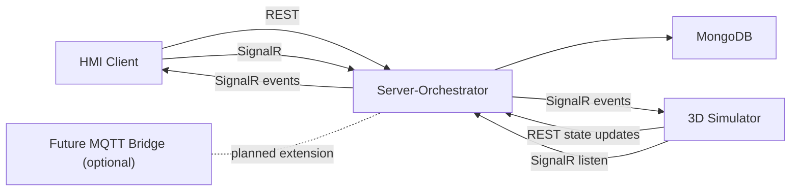

## Current Implementation Status

### Implemented

- separate simulator and backend projects
- separate HMI project scaffolded and structured
- shared `Contracts`, `Domain`, and `Infrastructure` backend layers
- MongoDB integration in the server
- Swagger-enabled backend API
- SignalR orchestration hub
- job lifecycle API:
  - create
  - list
  - start
  - pause
  - resume
  - stop
  - delete
- simulation session updates from the simulator
- machine state updates from the simulator
- single-conveyor simulator scene
- pallet machining workflow
- local simulator dashboard
- multilingual HMI setup

### In Progress

- full end-to-end simulator/server synchronization in all scenarios
- HMI feature completion and data completeness
- tighter mapping between pallet flow and backend job/task/session identifiers
- better operational feedback and traceability between all components

### Planned

- richer industrial HMI behavior
- improved alarm and operator message workflows
- deployment hardening
- optional MQTT bridge for external integrations
- broader production-style behavior and runtime supervision

## Screenshots / Demo

### Simulator

Main simulator scene:

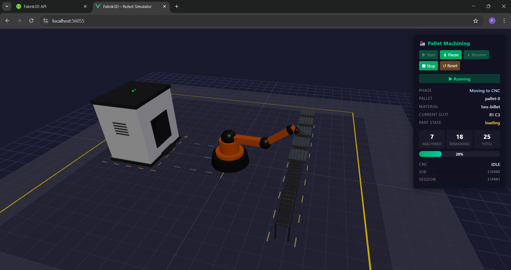


### HMI

HMI home screen:

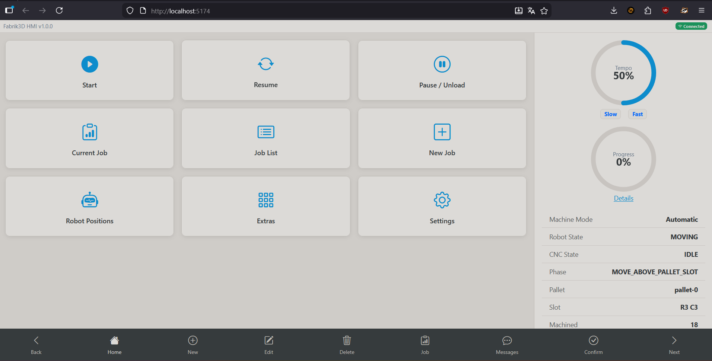

Current job view:

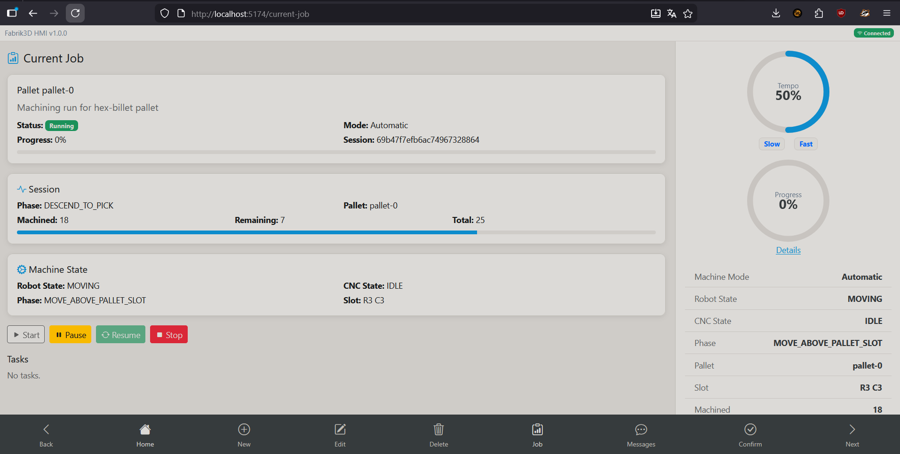

Job list view:

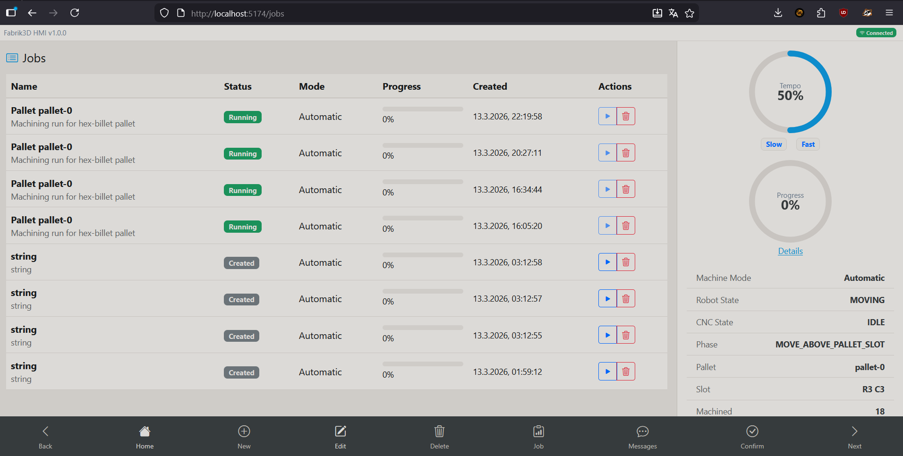

### Backend / API

Swagger and orchestration API examples:

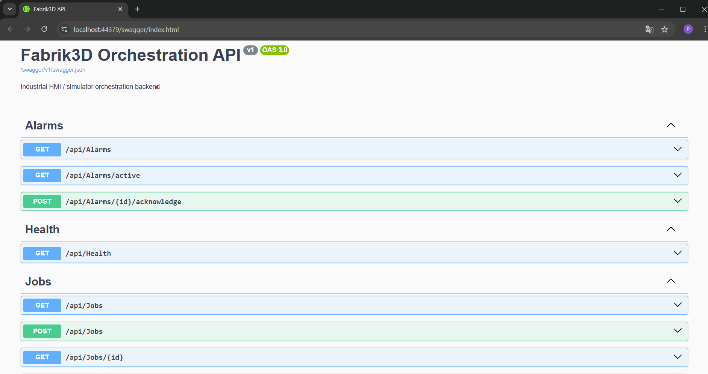

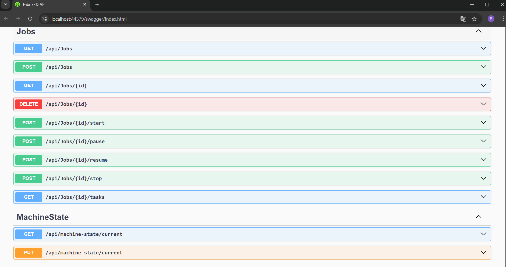

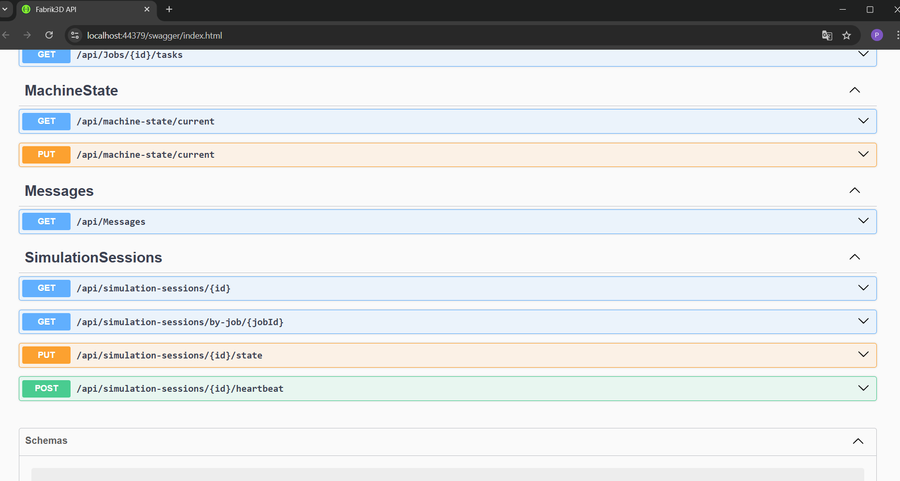

## Architecture Diagrams

### Full Solution

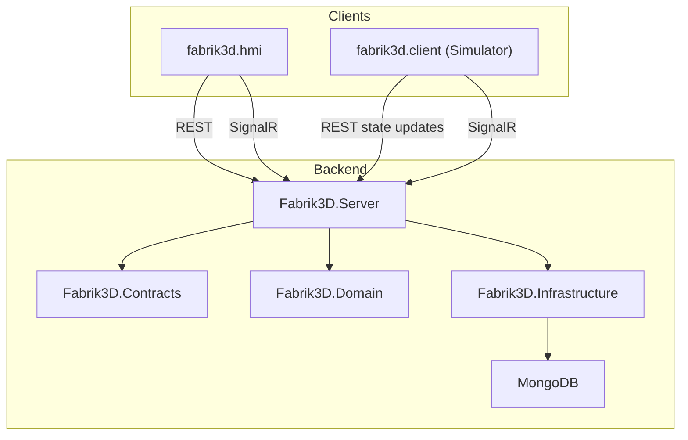

### HMI Architecture

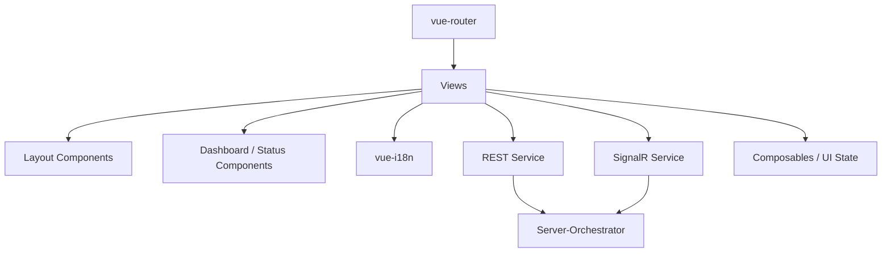

### Simulator Architecture

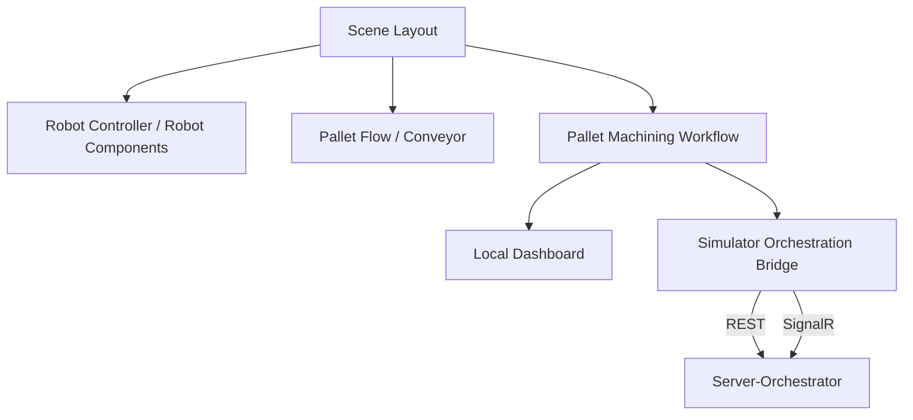

### Server-Orchestrator Architecture

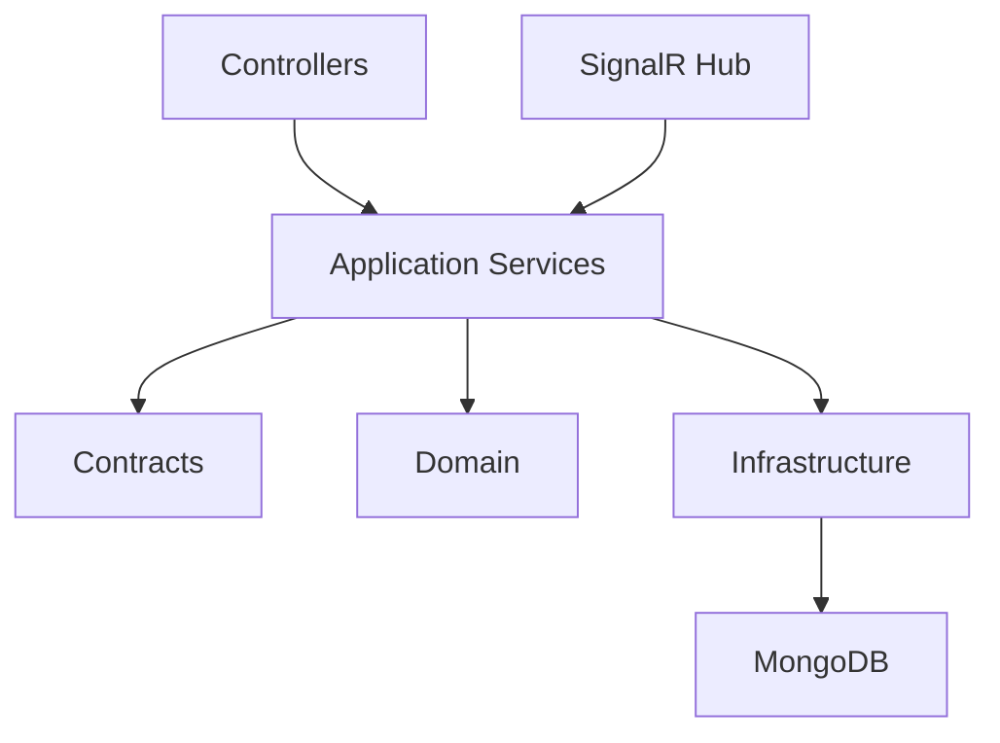

## Running The Solution Locally

### Prerequisites

- .NET 8 SDK
- Node.js (compatible with the Vue/Vite projects)
- MongoDB running locally

### 1. Start MongoDB

The backend expects:

- connection string: `mongodb://localhost:27017`
- database name: `Fabrik3D`

These values are configured in [appsettings.json](Fabrik3D/Fabrik3D.Server/appsettings.json).

### 2. Start The Server-Orchestrator

From the backend project:

```powershell
cd Fabrik3D\Fabrik3D.Server
dotnet run
```

Swagger is available from the backend launch profile, typically under `/swagger`.

### 3. Start The Simulator

From the simulator project:

```powershell
cd Fabrik3D\fabrik3d.client
npm install
npm run dev
```

The simulator uses:

- Three.js for rendering
- REST calls to the backend
- SignalR for orchestration events

### 4. Start The HMI

From the HMI project:

```powershell
cd Fabrik3D\fabrik3d.hmi
npm install
npm run dev
```

The HMI consumes:

- REST APIs for job/task/session/alarm/message operations
- SignalR events for live orchestration updates

### 5. Access The Backend API

The current backend exposes APIs for:

- jobs
- tasks by job
- simulation sessions
- machine state
- alarms
- operator messages
- health

Swagger is the easiest way to inspect and test these endpoints during development.

## Tech Stack

### HMI

- Vue 3
- TypeScript
- Vite
- Bootstrap
- vue-router
- vue-i18n
- SignalR JavaScript client

### Simulator

- Vue 3
- TypeScript
- Three.js
- Vite
- SignalR JavaScript client

### Server-Orchestrator

- ASP.NET Core (.NET 8)
- Swagger / OpenAPI
- SignalR
- MongoDB

### Shared Backend Layers

- Contracts:
  - DTOs
  - enums
  - events
- Domain:
  - entities
  - mapping
- Infrastructure:
  - MongoDB context
  - repositories
  - configuration

## Development Notes

- The **server** is intended to become the orchestration source of truth.
- The **simulator** executes the robotic cell behavior visually and reports runtime state.
- The **HMI** consumes REST and SignalR to display and control the system from an operator perspective.
- MongoDB is used for local persistence of jobs, sessions, machine states, alarms, and messages.
- Some synchronization behaviors are still evolving as the simulator/backend integration is refined.

## Roadmap / Next Steps

- complete robust simulator/server synchronization for all runtime cases
- continue refining the HMI screens and operator workflows
- improve alarm, message, and acknowledgment handling
- strengthen multilingual support across all HMI views
- improve traceability between local pallet objects and backend job/task/session identifiers
- add deployment and packaging improvements
- evaluate an optional MQTT bridge for future industrial-style integrations

