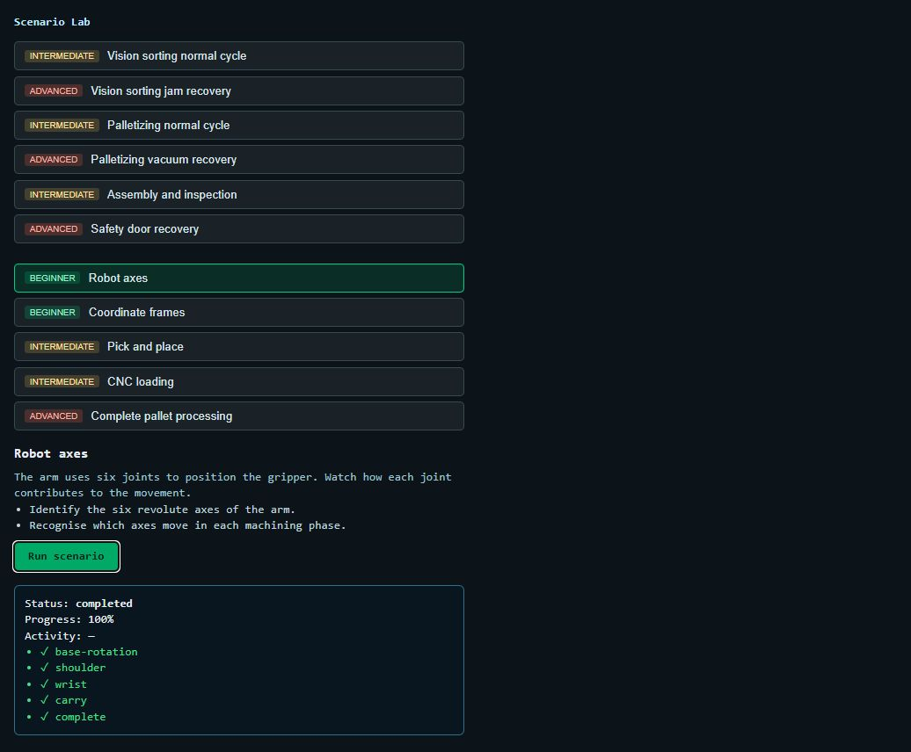
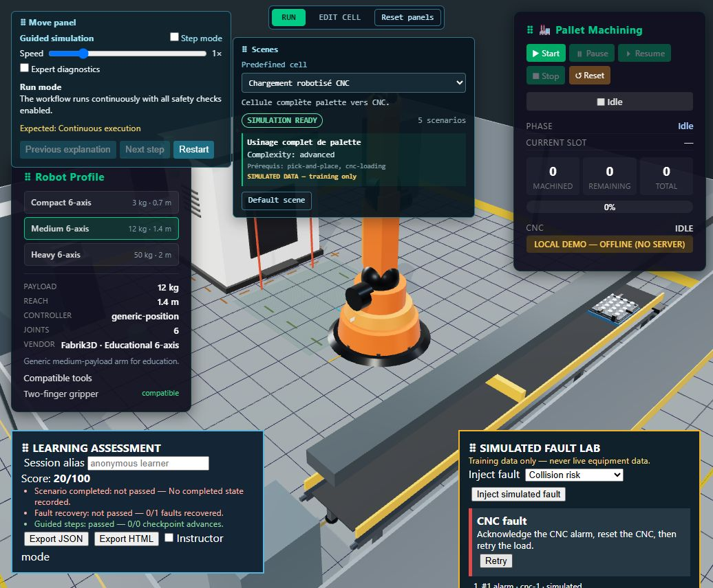
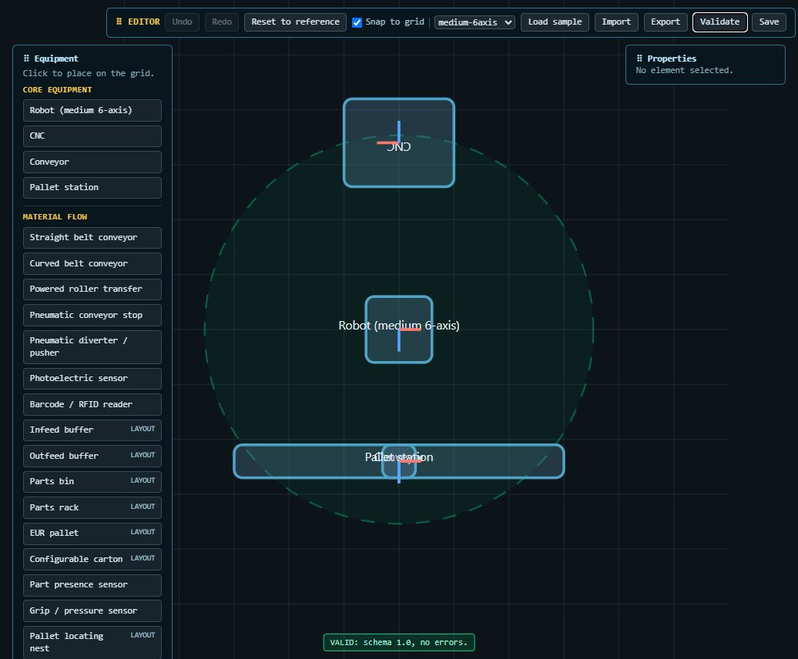
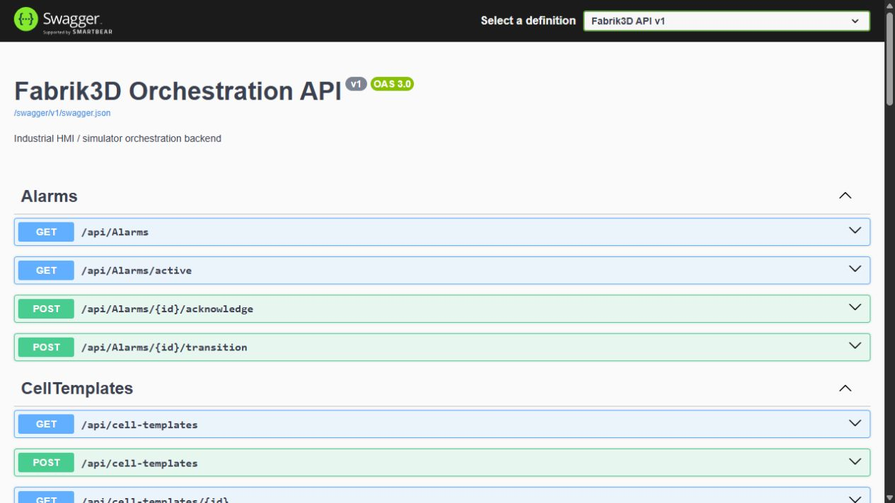
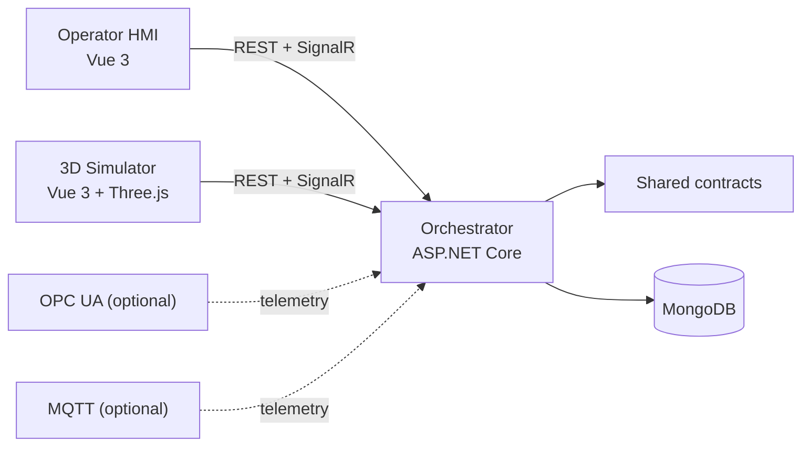

# Fabrik3DLite

Fabrik3DLite is an educational industrial-software demonstrator for designing, simulating, supervising, and understanding a robotic cell. It brings together a 3D robotic-cell simulator, an orchestration backend, and a dedicated operator HMI around an explicit digital-twin model.

It is intended for learning, technical demonstrations, and prototyping. It is **not** a safety-certified control system, an OEM robot-program emulator, or a substitute for commissioning a physical cell.

<p align="center">
  <a href="./media/Simulator.mp4" title="Open the MP4 demonstration">
    
  </a>
  <br />
  <em>Animated demonstration — click to open the MP4 version.</em>
</p>

## What is implemented

### 3D simulation and learning

- A Three.js robotic CNC-tending cell: pallet feed, six-axis robot, CNC door and machining cycle, part return, and runtime dashboard.
- Five versioned industrial scene presets: CNC tending, vision sorting, palletizing, assembly/inspection, and robot-safety training.
- Eleven guided scenarios, from robot axes and coordinate frames to complete pallet processing and fault-recovery exercises.
- Selectable compact, medium, and heavy generic six-axis robot profiles with reach, payload, joint-limit, tool-compatibility, kinematic, and safety data.
- Deterministic FK/IK-oriented kinematics, SI units, cell/work-object frames, reachability checks, collision primitives, and swept-path checks.
- A training fault lab with typed simulated faults, acknowledgement/reset/retry rules, ordered timeline, deterministic replay, and local learning reports.

### Cell authoring

- Visual editor with grid snapping, overlap detection, undo/redo, reference reset, and 2D plan view.
- Versioned portable cell files (`1.0`) with deterministic import/export, validation, legacy `0.9` migration, and compact/medium/heavy samples.
- Equipment, scene, visual-asset, collision-proxy, port, anchor, parameter, and telemetry-extension registries.
- Named cell-template persistence through the orchestrator.

### Orchestration and supervision

- ASP.NET Core server with MongoDB persistence, OpenAPI/Swagger, SignalR, shared contracts, correlation IDs, and optimistic concurrency.
- Explicit job claim model: the HMI creates work, a simulator claims it, and only that simulator can update its tasks, session, heartbeat, or machine state.
- Job, task, session, machine-state, alarm, message, and cell-template APIs.
- Heartbeat monitoring and faulted-session recovery.
- Separate, multilingual operator HMI (English, French, German) for jobs, active execution, alarms, messages, operating modes, and settings.
- Optional OPC UA and MQTT boundaries, kept outside core domain behavior and disabled by default.

## Demonstrations and evidence

| Scenario | Evidence |
| --- | --- |
| Basic guided scenario | `Robot axes` completed at 100% with its five expected activities. |
| Fault recovery | A simulated CNC fault requires acknowledgement and reset before retry. |
| Cell editor | A medium six-axis cell with robot, CNC, conveyor, and pallet station validates without schema errors. |
| Backend | The live orchestration API exposes alarms, templates, jobs, sessions, tasks, and state endpoints. |

<p align="center">
  
  
</p>

<p align="center">
  
  
</p>

The latest evidence set is available in [docs/evidence/simulation-2026-09-18](./docs/evidence/simulation-2026-09-18/).

## Architecture


```mermaid
flowchart LR
    HMI["Operator HMI\nVue 3"] -->|REST + SignalR| Server["Orchestrator\nASP.NET Core"]
    Simulator["3D Simulator\nVue 3 + Three.js"] -->|REST + SignalR| Server
    Server --> Contracts["Shared contracts"]
    Server --> Mongo[(MongoDB)]
    OpcUa["OPC UA (optional)"] -. telemetry .-> Server
    Mqtt["MQTT (optional)"] -. telemetry .-> Server
```

The server is the orchestration source of truth. In connected mode, a simulator claims a server-side job and reports its state through the shared contracts. If no server or runnable job is available, the simulator explicitly switches to a local-only offline demonstration and never writes to the server.

## Core workflow

1. An operator creates and starts a job through the HMI or API; jobs may carry pallet-slot tasks.
2. The simulator claims the runnable job and receives its declared tasks.
3. The robot processes each slot: pick, CNC load, machining, retrieval, and return to the pallet.
4. The simulator updates task, session, machine, and heartbeat state through the backend.
5. The HMI receives live job and session changes through SignalR.

The backend enforces ownership: a foreign or offline simulator cannot overwrite an active session.

## Repository layout

```text
Fabrik3DLite/
├─ Fabrik3D/
│  ├─ fabrik3d.client/          # 3D simulator, editor, scenarios, safety
│  ├─ fabrik3d.hmi/             # Operator HMI
│  ├─ Fabrik3D.Server/          # API, SignalR hub, orchestration services
│  ├─ Fabrik3D.Contracts/       # C# contracts and generated TS contract source
│  ├─ Fabrik3D.Domain/          # Domain entities and transition rules
│  ├─ Fabrik3D.Infrastructure/  # MongoDB persistence and optional adapters
│  └─ Fabrik3D.slnx
├─ docs/                        # Architecture, setup, testing, roadmap, evidence
├─ media/                       # Demo video, GIF, and legacy screenshots
└─ scripts/                     # Contract, asset, and roadmap automation
```

## Run locally

### Prerequisites

- .NET 8 SDK
- Node.js 20.19+ or 22.12+
- MongoDB running locally at `mongodb://localhost:27017`

### Start the services

```powershell
# Terminal 1 — server and Swagger
cd Fabrik3D/Fabrik3D.Server
dotnet run

# Terminal 2 — simulator
cd Fabrik3D/fabrik3d.client
npm install
npm run dev

# Terminal 3 — HMI
cd Fabrik3D/fabrik3d.hmi
npm install
npm run dev
```

Swagger is available from the server launch profile, usually at `/swagger`. For detailed configuration, URL troubleshooting, and environment overrides, see [local setup](./docs/development/SETUP.md) and [troubleshooting](./docs/development/TROUBLESHOOTING.md).

## Verification

The project has deterministic tests for contracts, state transitions, geometry, kinematics, safety checks, editor persistence, scenarios, visual regressions, and orchestration ownership.

```powershell
# From the repository root
npm run contracts:check
npm --prefix Fabrik3D/fabrik3d.client run type-check
npm --prefix Fabrik3D/fabrik3d.client run test
npm --prefix Fabrik3D/fabrik3d.client run test:visual
npm --prefix Fabrik3D/fabrik3d.hmi run type-check
npm --prefix Fabrik3D/fabrik3d.hmi run test
npm --prefix Fabrik3D/fabrik3d.hmi run build
dotnet test Fabrik3D/Fabrik3D.slnx --no-build
```

See [the testing guide](./docs/TESTING.md) for test layers, isolated MongoDB integration tests, and the connected E2E configuration.

## Scope and boundaries

- All educational fault, safety, and learning data are explicitly simulated.
- Safety visuals and motion guards are engineering/teaching aids, not certified safety functions.
- Robot profiles are vendor-neutral generic profiles, not exact OEM models.
- Replay is read-only: replayed telemetry cannot issue commands to a connector.
- OPC UA and MQTT writes remain disabled unless deliberately enabled and allow-listed in local configuration.

## Further documentation

- [Orchestration and traceability](./docs/architecture/ORCHESTRATION.md)
- [Kinematics and frames](./docs/architecture/KINEMATICS_AND_FRAMES.md)
- [Cell files and editor boundaries](./docs/architecture/CELL_FILES.md)
- [Faults, timeline, and replay](./docs/architecture/FAULTS_TIMELINE_REPLAY.md)
- [Digital-twin telemetry](./docs/architecture/DIGITAL_TWIN_TELEMETRY.md)
- [Predefined industrial scenes](./docs/architecture/PREDEFINED_INDUSTRIAL_SCENES.md)
- [HMI design system](./docs/architecture/HMI_DESIGN_SYSTEM.md)
- [Roadmap](./docs/roadmap/README.md)
