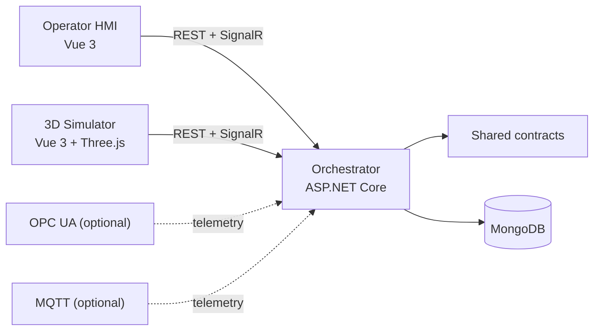
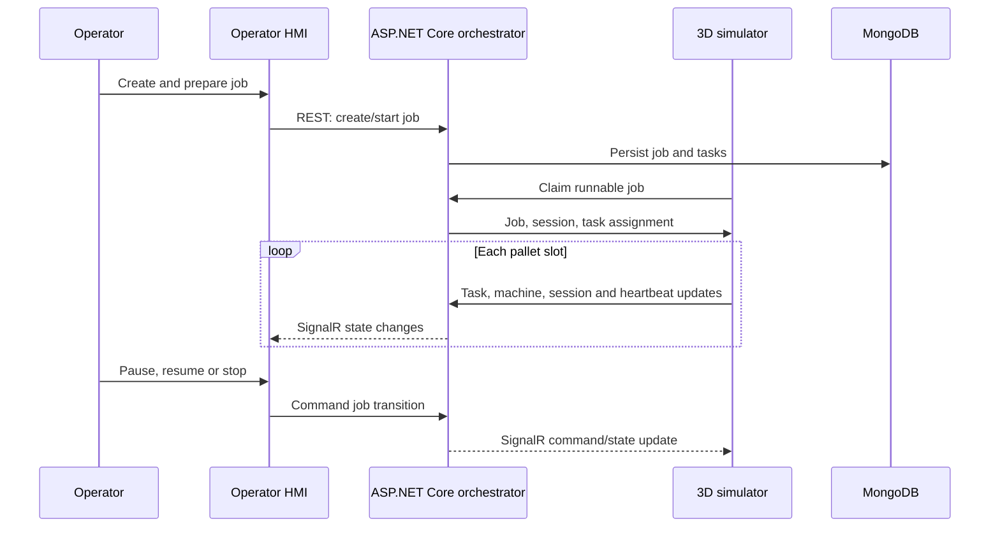

# Fabrik3DLite

[](https://github.com/VirgileDjimgou/Fabrik3DLite/actions/workflows/ci.yml)
[](https://github.com/VirgileDjimgou/Fabrik3DLite/actions/workflows/docker.yml)
[](https://dotnet.microsoft.com/)
[](https://nodejs.org/)
[](https://www.mongodb.com/)

Fabrik3DLite is an educational industrial-software demonstrator for designing, simulating, supervising, and understanding a robotic cell. It brings together a 3D robotic-cell simulator, an orchestration backend, and a dedicated operator HMI around an explicit digital-twin model.

It is intended for learning, technical demonstrations, and prototyping. It is **not** a safety-certified control system, an OEM robot-program emulator, or a substitute for commissioning a physical cell.

## Live demo

The public demonstration runs the complete Docker stack simulator, operator HMI, ASP.NET Core orchestrator, and MongoDB on Hetzner and is published through Cloudflare Tunnel. Both interfaces use the same live orchestration backend.

| Interface        | Link                                                      | Use it for                                                                       |
| ---------------- | --------------------------------------------------------- | -------------------------------------------------------------------------------- |
| **3D simulator** | [Open the simulator](https://fabrik3d.patrickdjimgou.dev) | Run scenes, guided learning scenarios, fault exercises, and cell editing.        |
| **Operator HMI** | [Open the HMI](https://fabrik3d-hmi.patrickdjimgou.dev)   | Create and supervise jobs, inspect machine state, and follow execution progress. |

### Demo limitations

- This is a shared public training environment: jobs, simulated machine state, and learning data may be changed or reset by other visitors.
- Every robot, CNC, alarm, safety condition, and production signal is simulated; the hosted demo is not connected to physical equipment.
- OPC UA and MQTT integrations are disabled in the public deployment. No command is sent to an industrial controller.
- Availability is best-effort. The instance can be restarted or updated without notice during maintenance and development.

### Product walkthrough

https://github.com/user-attachments/assets/29b87539-a47f-4b07-9dd0-f6e0fa9c2436

_The walkthrough covers a completed scenario, CNC fault recovery, cell editing, and orchestration through the backend API._

## What is implemented

### 3D simulation and learning

- A Three.js robotic CNC-tending cell: pallet feed, six-axis robot, CNC door and machining cycle, part return, and runtime dashboard.
- Five versioned industrial scene presets: CNC tending, vision sorting, palletizing, assembly/inspection, and robot-safety training.
- Eleven guided scenarios, from robot axes and coordinate frames to complete pallet processing and fault-recovery exercises.
- Selectable compact, medium, and heavy generic six-axis robot profiles with reach, payload, joint-limit, tool-compatibility, kinematic, and safety data.
- Deterministic FK/IK-oriented kinematics, SI units, cell/work-object frames, reachability checks, collision primitives, and swept-path checks.
- A training fault lab with typed simulated faults, acknowledgement/reset/retry rules, ordered timeline, deterministic replay, and local learning reports.

### Industrial signal foundation

- A versioned, protocol-independent signal model (schema `1.0`) with typed values, engineering units, direction semantics, quality, update origin, source arbitration, range/enum validation and read-time staleness.
- A deterministic `SignalRegistry` with stable ids, discovery by equipment and equipment-SDK integration through optional signal declarations.
- A signal-driven CNC reference cell: 43 vendor-neutral signals across robot, CNC, conveyor and safety equipment, bound to the actual runtime. Command signals (Start/Stop/Reset, door, cycle start, conveyor run/speed, safety reset) drive the same workflow, CNC, conveyor and interlock paths as the operator controls, and status signals are derived from real state each frame.
- An engineering I/O signal inspector (`?view=signals` or the expert dock panel) with filters, live quality/source/timestamp and binding-coverage diagnostics.
- Deterministic snapshot serialization, schema-version validation and a documented migration mechanism. The server-side C# mirror (schema `1.0`) backs the real OPC UA transport; MQTT (S34) and Modbus (S35) transports remain planned and are not implemented yet.

### Cell authoring

- Visual editor with grid snapping, overlap detection, undo/redo, reference reset, and 2D plan view.
- Versioned portable cell files (`1.0`) with deterministic import/export, validation, legacy `0.9` migration, and compact/medium/heavy samples.
- Equipment, scene, visual-asset, collision-proxy, port, anchor, parameter, and telemetry-extension registries.
- Named cell-template persistence through the orchestrator.

### Orchestration and supervision

- ASP.NET Core server with MongoDB persistence, OpenAPI/Swagger, SignalR, shared contracts, correlation IDs, and optimistic concurrency.
- Explicit job claim model: the HMI creates work, a simulator claims it, and only that simulator can update its tasks, session, heartbeat, or machine state.
- Job, task, session, machine-state, alarm, message, and cell-template APIs.
- Heartbeat monitoring and faulted-session recovery.
- Separate, multilingual operator HMI (English, French, German) for jobs, active execution, alarms, messages, operating modes, and settings.
- Optional OPC UA and MQTT boundaries, kept outside core domain behavior and disabled by default.
- Real OPC UA client transport (S33, implemented): session/subscription lifecycle, bounded-backoff reconnect, explicit certificate trust (development auto-accept is opt-in and warned), monitored items from an explicit node map, quality/timestamp mapping into the protocol-free signal mirror, fail-closed write policy (`AllowWrites` + exact allow-list + writable signal), health/diagnostics counters and `GET /api/connectors/opcua`. Aligned with selected OPC UA concepts; not IEC 62541 certified. MQTT remains disabled stub work for S34.

## Operator HMI

The HMI is the operator-facing surface of Fabrik3D. It provides a touch-oriented command area, a live machine-status sidebar, job preparation and supervision views, and a persistent action bar. The same orchestration state is shared with the simulator through the ASP.NET Core backend and SignalR.

<p align="center">
  
  
  
</p>

| View            | Purpose                                                                                                      |
| --------------- | ------------------------------------------------------------------------------------------------------------ |
| **Home**        | Access to start, pause, resume, jobs, positions, messages, and settings, with continuous production context. |
| **Jobs**        | Work queue, state, mode, progress, creation time, and operator actions.                                      |
| **Current job** | Job, session, task, pallet, CNC, robot, and progress details for the active execution.                       |

## Demonstrations and evidence

| Scenario              | Evidence                                                                                              |
| --------------------- | ----------------------------------------------------------------------------------------------------- |
| Basic guided scenario | `Robot axes` completed at 100% with its five expected activities.                                     |
| Fault recovery        | A simulated CNC fault requires acknowledgement and reset before retry.                                |
| Cell editor           | A medium six-axis cell with robot, CNC, conveyor, and pallet station validates without schema errors. |
| Backend               | The live orchestration API exposes alarms, templates, jobs, sessions, tasks, and state endpoints.     |

<p align="center">
  
  
</p>

<p align="center">
  
  
</p>

The latest evidence set is available in [docs/evidence/simulation-2026-09-18](./docs/evidence/simulation-2026-09-18/).

## Architecture


```mermaid
flowchart LR
    HMI["Operator HMI\nVue 3"] -->|REST + SignalR| Server["Orchestrator\nASP.NET Core"]
    Simulator["3D Simulator\nVue 3 + Three.js"] -->|REST + SignalR| Server
    Server --> Contracts["Shared contracts"]
    Server --> Mongo[(MongoDB)]
    OpcUa["OPC UA (optional)"] -. telemetry .-> Server
    Mqtt["MQTT (optional)"] -. telemetry .-> Server
```

The server is the orchestration source of truth. In connected mode, a simulator claims a server-side job and reports its state through the shared contracts. If no job is claimed, the simulator explicitly identifies the run as local and never writes simulated execution state to the server.

## Core workflow


```mermaid
sequenceDiagram
    participant Operator as Operator
    participant HMI as Operator HMI
    participant API as ASP.NET Core orchestrator
    participant Simulator as 3D simulator
    participant Mongo as MongoDB

    Operator->>HMI: Create and prepare job
    HMI->>API: REST: create/start job
    API->>Mongo: Persist job and tasks
    Simulator->>API: Claim runnable job
    API->>Simulator: Job, session, task assignment
    loop Each pallet slot
        Simulator->>API: Task, machine, session and heartbeat updates
        API-->>HMI: SignalR state changes
    end
    Operator->>HMI: Pause, resume or stop
    HMI->>API: Command job transition
    API-->>Simulator: SignalR command/state update
```

1. The operator prepares a job through the HMI or API; jobs may carry pallet-slot tasks.
2. The simulator claims the runnable job, processes the physical-cell model, and reports progress through the backend.
3. The HMI remains the operator interface and receives the resulting state changes in real time.

The backend enforces ownership: a foreign or offline simulator cannot overwrite an active session.

## Repository layout

```text
Fabrik3DLite/
├─ Fabrik3D/
│  ├─ fabrik3d.client/          # 3D simulator, editor, scenarios, safety
│  ├─ fabrik3d.hmi/             # Operator HMI
│  ├─ Fabrik3D.Server/          # API, SignalR hub, orchestration services
│  ├─ Fabrik3D.Contracts/       # C# contracts and generated TS contract source
│  ├─ Fabrik3D.Domain/          # Domain entities and transition rules
│  ├─ Fabrik3D.Infrastructure/  # MongoDB persistence and optional adapters
│  └─ Fabrik3D.slnx
├─ docs/                        # Architecture, setup, testing, roadmap, evidence
├─ media/                       # Demo video, GIF, and legacy screenshots
└─ scripts/                     # Contract, asset, and roadmap automation
```

## Run locally

### Prerequisites

- .NET 8 SDK
- Node.js 20.19+ or 22.12+
- MongoDB running locally at `mongodb://localhost:27017`

### Start the services

```powershell
# Terminal 1 — server and Swagger
cd Fabrik3D/Fabrik3D.Server
dotnet run

# Terminal 2 — simulator
cd Fabrik3D/fabrik3d.client
npm install
npm run dev

# Terminal 3 — HMI
cd Fabrik3D/fabrik3d.hmi
npm install
npm run dev
```

Swagger is available from the server launch profile, usually at `/swagger`. For detailed configuration, URL troubleshooting, and environment overrides, see [local setup](./docs/development/SETUP.md) and [troubleshooting](./docs/development/TROUBLESHOOTING.md).

### Run with Docker

The production-style stack — MongoDB, orchestrator, simulator, and HMI behind Nginx — is described by [`Fabrik3D/compose.production.yaml`](./Fabrik3D/compose.production.yaml). Docker Engine with Compose v2 is the only prerequisite; images are built locally from this repository.

```bash
# Build and start the whole stack
docker compose -f Fabrik3D/compose.production.yaml up --build

# Stop (add -v to also reset the MongoDB volume)
docker compose -f Fabrik3D/compose.production.yaml down
```

| Service           | URL                   |
| ----------------- | --------------------- |
| Simulator         | http://localhost:8081 |
| Operator HMI      | http://localhost:8082 |
| Orchestration API | http://localhost:8080 |

The Docker [workflow](./.github/workflows/docker.yml) validates the compose file and builds the same images on every push, so the Docker badge above reflects whether the container setup still builds.

## Verification

The project has deterministic tests for contracts, state transitions, geometry, kinematics, safety checks, editor persistence, scenarios, visual regressions, and orchestration ownership.

```powershell
# From the repository root
npm run contracts:check
npm --prefix Fabrik3D/fabrik3d.client run type-check
npm --prefix Fabrik3D/fabrik3d.client run test
npm --prefix Fabrik3D/fabrik3d.client run test:visual
npm --prefix Fabrik3D/fabrik3d.hmi run type-check
npm --prefix Fabrik3D/fabrik3d.hmi run test
npm --prefix Fabrik3D/fabrik3d.hmi run build
dotnet test Fabrik3D/Fabrik3D.slnx --no-build
```

See [the testing guide](./docs/TESTING.md) for test layers, isolated MongoDB integration tests, and the connected E2E configuration.

### Autonomous sprint batches (maintainers)

`Start Next Sprint` (or `/start-next-sprint` in OpenCode) starts the bounded autopilot: up to **10** sprints implemented one at a time in fresh child sessions, each independently verified before the following sprint may start, with immediate stops for human gates, external blockers or unresolved failures.

```powershell
npm run sprint:batch:dry-run   # preview the sprints that would run; mutates nothing
npm run sprint:batch:start     # launch the detached bounded batch
npm run sprint:batch:status    # read-only progress, lock and human-gate state
npm run sprint:batch:stop      # graceful stop after the current worker returns
```

The full contract, stop conditions and human-gate procedure are documented in [the sprint autopilot guide](./docs/roadmap/AUTOPILOT.md).

## Scope and boundaries

- All educational fault, safety, and learning data are explicitly simulated.
- Safety visuals and motion guards are engineering/teaching aids, not certified safety functions.
- Robot profiles are vendor-neutral generic profiles, not exact OEM models.
- Replay is read-only: replayed telemetry cannot issue commands to a connector.
- OPC UA and MQTT writes remain disabled unless deliberately enabled and allow-listed in local configuration.

## Further documentation

- [Orchestration and traceability](./docs/architecture/ORCHESTRATION.md)
- [Industrial signal core](./docs/architecture/INDUSTRIAL_SIGNAL_CORE.md)
- [Reference cell signal catalog](./docs/architecture/REFERENCE_SIGNAL_CATALOG.md)
- [Kinematics and frames](./docs/architecture/KINEMATICS_AND_FRAMES.md)
- [Cell files and editor boundaries](./docs/architecture/CELL_FILES.md)
- [Faults, timeline, and replay](./docs/architecture/FAULTS_TIMELINE_REPLAY.md)
- [Digital-twin telemetry](./docs/architecture/DIGITAL_TWIN_TELEMETRY.md)
- [Predefined industrial scenes](./docs/architecture/PREDEFINED_INDUSTRIAL_SCENES.md)
- [HMI design system](./docs/architecture/HMI_DESIGN_SYSTEM.md)
- [Roadmap](./docs/roadmap/README.md)
