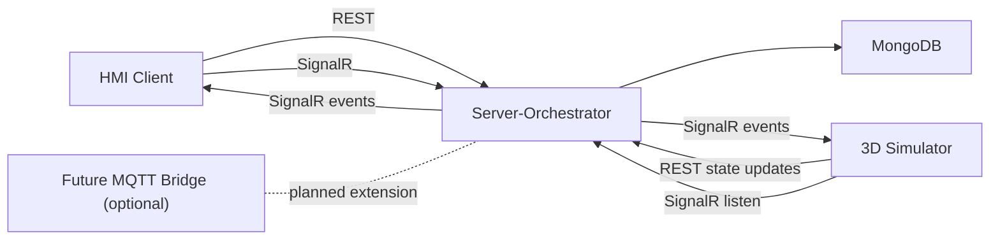
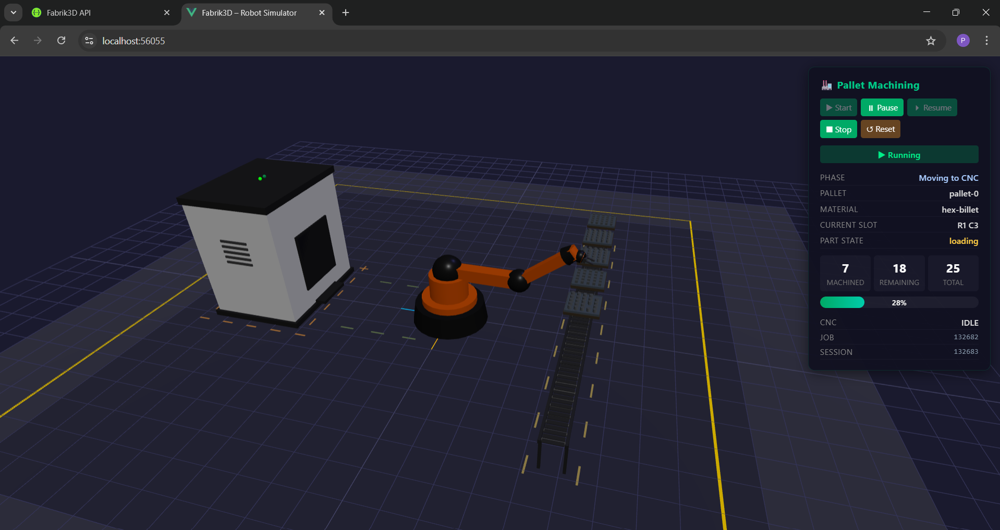
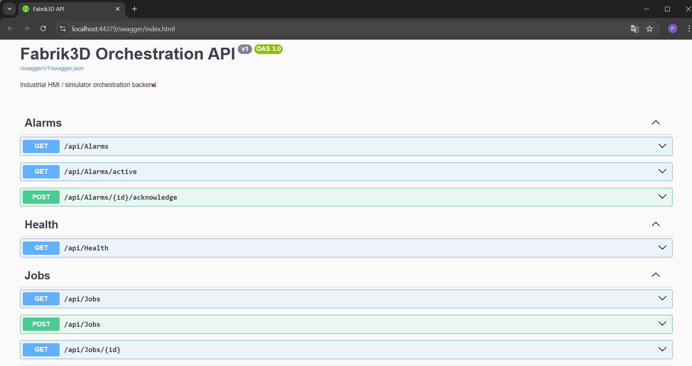
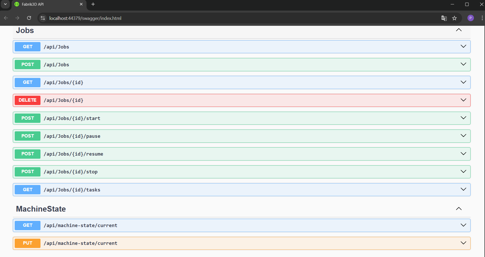
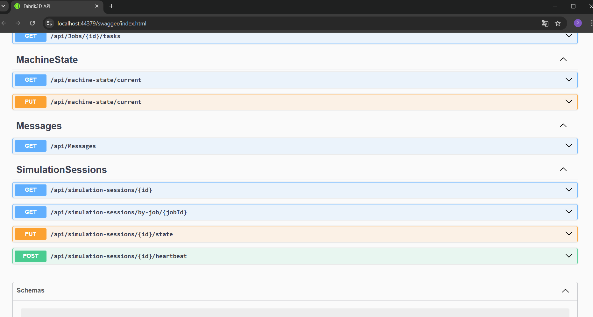
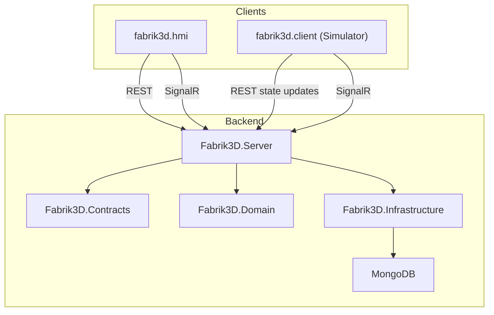
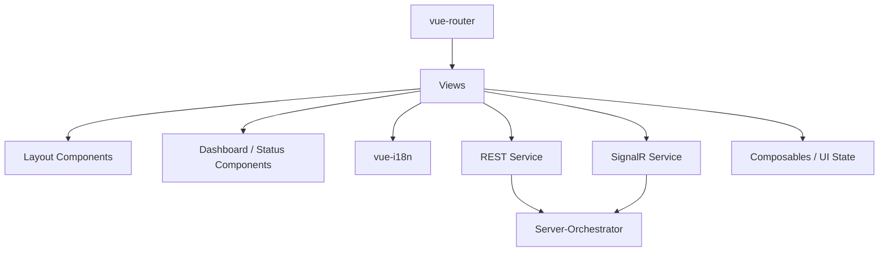
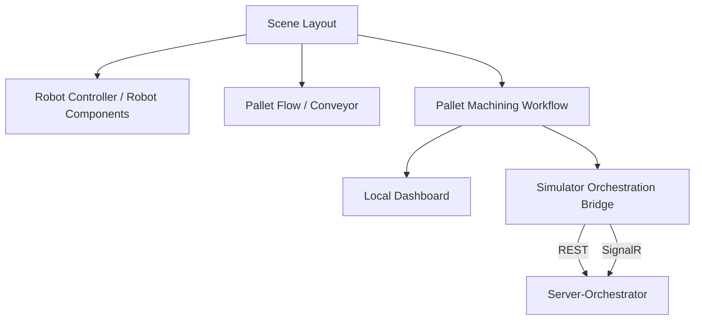
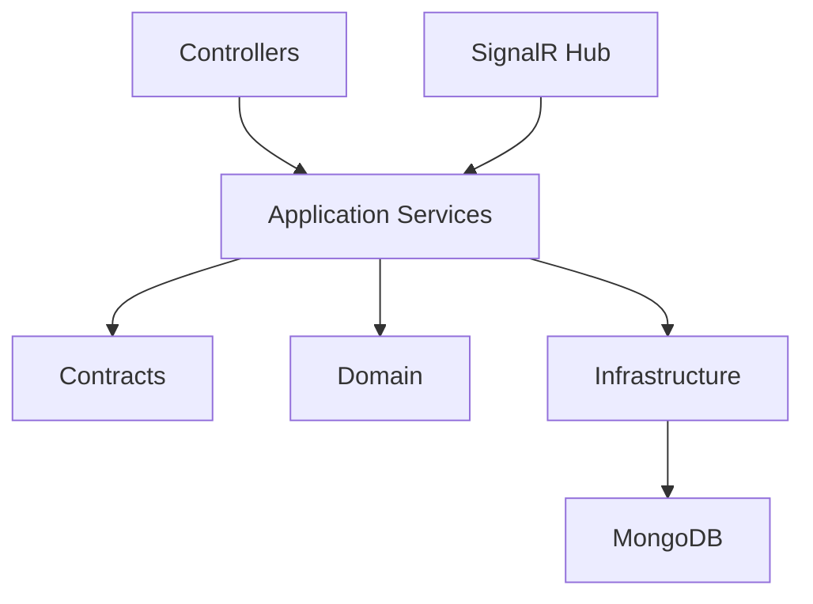

# Fabrik3DLite

Fabrik3DLite is a modular industrial software prototype built around a robotic machining cell. The repository combines a 3D simulator, an orchestration backend, and a dedicated HMI client to explore how an industrial operator interface, a machine simulation, and a task manager can work together.

The project is designed first as an educational and prototyping environment: it helps model a robot + CNC workflow, visualize machine behavior, and progressively evolve toward a more realistic industrial software stack.


Animated machining workflow:


## Vision

The original idea behind Fabrik3DLite is to simulate a small automated machining cell in a way that remains understandable for students, demonstrable for presentations, and extensible for more advanced industrial scenarios.

The long-term goal is not just a 3D animation. It is a full solution where:

- an operator interacts with a dedicated HMI
- a simulator executes the cell behavior visually
- a central backend orchestrates jobs, sessions, machine states, alarms, and messages
- each part communicates through explicit application contracts

Today, the repository already contains the foundation for that architecture.

## What The Solution Contains

The solution currently includes:

- a **3D simulator client** built with Vue 3, TypeScript, and Three.js
- a **server-orchestrator** built with ASP.NET Core, MongoDB, Swagger, and SignalR
- shared backend layers:
  - **Contracts**
  - **Domain**
  - **Infrastructure**
- a separate **HMI client** built with Vue 3, TypeScript, Bootstrap, vue-router, vue-i18n, and SignalR

At a high level, the system models a pallet-based machining scenario:

1. a pallet arrives in the simulated work area
2. the robot picks a raw part from a pallet slot
3. the robot loads the part into the CNC
4. the CNC performs machining
5. the robot retrieves the part
6. the robot returns the machined part to the original pallet slot

## Main Features

### Simulator

- 3D robotic cell rendering with Three.js
- industrial robot model with articulated joints
- CNC machine model and CNC door/machining cycle behavior
- pallet conveyor flow and raw material pallets
- pallet-to-CNC-to-same-pallet workflow
- local operator dashboard for runtime monitoring
- progressive integration with the backend orchestrator

### Server-Orchestrator

- job and task lifecycle management
- simulation session tracking
- machine state persistence
- alarm and operator message APIs
- MongoDB persistence
- REST API documented via Swagger
- SignalR hub for real-time orchestration events

### HMI

- dedicated operator interface separate from the simulator
- multi-view structure inspired by industrial touch HMIs
- multilingual setup:
  - English
  - German
  - French
- job list, current job, messages, alarms, settings, and home dashboard views
- Bootstrap-based, scalable, industrial-style interface

## Solution Architecture Overview

The repository is organized as one solution with multiple focused projects:

```text
Fabrik3DLite/
├─ README.md
├─ media/
├─ Fabrik3D/
│  ├─ fabrik3d.client/         # 3D simulator
│  ├─ fabrik3d.hmi/            # Operator HMI
│  ├─ Fabrik3D.Server/         # Orchestration backend
│  ├─ Fabrik3D.Contracts/      # Shared DTOs, enums, events
│  ├─ Fabrik3D.Domain/         # Domain entities and mapping
│  ├─ Fabrik3D.Infrastructure/ # MongoDB persistence and repositories
│  └─ Fabrik3D.slnx
```

## Subprojects

### HMI

The HMI client is a separate Vue 3 + TypeScript frontend intended to mimic a real industrial operator interface. It is designed around clear navigation, large tiles, a right-side status area, and multilingual operator-oriented views.

Current focus:

- home dashboard
- current job
- job list
- new job
- messages
- alarms
- settings
- robot positions placeholder

### Simulator

The simulator is the visual execution layer. It renders the robotic cell, pallet flow, and machining sequence. It contains the 3D scene, robot controller, workflow state machine, pallet logic, and a local runtime dashboard.

Current focus:

- single-conveyor machining cell
- pallet feed and slot tracking
- robot-to-CNC execution workflow
- local dashboard and orchestration bridge
- versioned equipment SDK with legacy robot, CNC and pallet-station adapters
- versioned GLB asset manifests, renderer-only asset registry, safe procedural fallbacks, and Blender authoring template
- generated modular conveyor and pallet-station GLBs with LODs, PBR scene lighting, semantic sensor binding, and deterministic collision alignment
- profile-aware, renderer-independent FK/IK model with explicit cell/work-object frames
- guided step mode with logical checkpoints, idempotent advancement and safety-preserving explanations
- robot catalog with selectable compact/medium/heavy six-axis profiles and end-effector compatibility metadata
- mesh-independent motion safety: collision primitives, reachability validation, swept-path gating, structured alarms and a diagnostics overlay
- visual cell editor (separate from execution mode) with grid-snapped transforms, overlap detection, undo/redo, reset-to-reference, and a plan-view canvas
- versioned, deterministic cell files (schema 1.0, legacy 0.9 migration) with import/export, validation, samples, and orchestrator-persisted named templates
- educational scenario engine with a versioned scenario format, five reference scenarios (en/fr/de), a deterministic scenario runner, and orchestrator-observable progress
- simulated-fault training lab with typed recovery rules, ordered event timeline, and deterministic replay
- trace-derived local learning assessment with transparent scoring and JSON/HTML reports
- ISA-101-inspired, multilingual operator-HMI design tokens, semantic status states, and target-confirmed commands

### Server-Orchestrator

The server is the central coordination layer. It exposes REST APIs and SignalR events for jobs, sessions, machine state, alarms, and operator messages. It is intended to become the source of truth for both the simulator and the HMI.

Current focus:

- create/list/start/pause/resume/stop jobs
- explicit claim/assignment of runnable jobs to a simulator (no implicit jobs)
- task lifecycle updates tied to the claimed session
- session state updates from the simulator (ownership-protected)
- machine state updates from the simulator (ownership-protected)
- heartbeat monitoring with stale-session fault detection
- correlation ids on commands, logs, and SignalR events
- real-time state distribution through SignalR
- local MongoDB persistence
- named cell template persistence (versioned cell files) with a write-authorization placeholder

### Contracts

`Fabrik3D.Contracts` contains shared DTOs, enums, and SignalR event payloads used by the backend and intended to align future client integrations.

### Domain

`Fabrik3D.Domain` contains the business entities and mapping logic for the orchestration domain:

- `Job`
- `MachiningTask`
- `SimulationSession`
- `MachineState`
- `Alarm`
- `OperatorMessage`

### Infrastructure

`Fabrik3D.Infrastructure` contains MongoDB-related persistence concerns:

- MongoDB settings
- MongoDB context
- repositories for jobs, tasks, sessions, alarms, messages, and machine state

## Communication Model

At the current stage, the intended communication model is:

- **REST** for explicit commands and queries
- **SignalR** for live state propagation
- **MongoDB** for persistence

The server is intended to act as the orchestration source of truth.

Coherent identity model (see `docs/architecture/ORCHESTRATION.md`):

- The HMI creates jobs; the simulator **claims** an existing runnable job and its simulation session instead of creating implicit jobs.
- Only the claiming simulator may push session state, task status, machine state, and heartbeats for that session.
- Every command carries an `X-Correlation-Id` that is echoed in logs and SignalR events.
- Stale heartbeats mark the session `Faulted`; an owner heartbeat revives it.
- Without a server connection the simulator runs a clearly identified **local-only offline demo** that never writes to the server.


```mermaid
flowchart LR
    HMI["HMI Client"] -- "REST" --> Server["Server-Orchestrator"]
    HMI -- "SignalR" --> Server
    Simulator["3D Simulator"] -- "REST state updates" --> Server
    Simulator -- "SignalR listen" --> Server
    Server --> Mongo["MongoDB"]
    Server -- "SignalR events" --> HMI
    Server -- "SignalR events" --> Simulator
    Future["Future MQTT Bridge (optional)"] -. "planned extension" .- Server
```

## Current Implementation Status

### Implemented

- separate simulator and backend projects
- separate HMI project scaffolded and structured
- shared `Contracts`, `Domain`, and `Infrastructure` backend layers
- MongoDB integration in the server
- Swagger-enabled backend API
- SignalR orchestration hub
- job lifecycle API:
  - create
  - list
  - start
  - pause
  - resume
  - stop
  - delete
  - claim (explicit simulator assignment, idempotent, recovery on expired heartbeat)
- task status updates from the owning simulator (pallet slots mapped to backend tasks)
- simulation session updates from the simulator (ownership-protected)
- machine state updates from the simulator (ownership-protected)
- heartbeat monitoring with stale-session fault detection and revival
- correlation ids on commands, logs, and SignalR events
- optimistic concurrency (version fields) rejecting concurrent conflicting commands
- single-conveyor simulator scene
- pallet machining workflow
- local simulator dashboard (online orchestrated mode and clearly identified local-only offline demo)
- robot catalog with three selectable generic six-axis profiles, end-effector compatibility metadata, and visual regression coverage
- motion safety with deterministic collision primitives, reachability validation, swept-path gating, structured simulation alarms, and a diagnostics overlay
- visual cell editor MVP with catalog insertion, grid-snapped placement, invalid-overlap feedback, undo/redo, reset-to-reference template, and visual regression coverage
- versioned deterministic cell files (schema 1.0 + 0.9 migration) with local import/export, validation, samples, and orchestrator-persisted named templates
- educational scenario engine with five reference scenarios, deterministic runner, and orchestrator-observable progress
- multilingual HMI setup

### In Progress

- full end-to-end simulator/server synchronization in all scenarios
- HMI feature completion and data completeness
- tighter mapping between pallet flow and backend job/task/session identifiers
- better operational feedback and traceability between all components

### Planned

- richer industrial HMI behavior
- improved alarm and operator message workflows
- deployment hardening
- optional MQTT bridge for external integrations
- broader production-style behavior and runtime supervision

## Screenshots / Demo

### Simulator

Main simulator scene:




### HMI

HMI home screen:


Current job view:


Job list view:


### Backend / API

Swagger and orchestration API examples:







## Architecture Diagrams

### Full Solution


```mermaid
flowchart TB
    subgraph Clients
        HMI["fabrik3d.hmi"]
        SIM["fabrik3d.client (Simulator)"]
    end

    subgraph Backend
        SERVER["Fabrik3D.Server"]
        CONTRACTS["Fabrik3D.Contracts"]
        DOMAIN["Fabrik3D.Domain"]
        INFRA["Fabrik3D.Infrastructure"]
        DB["MongoDB"]
    end

    HMI -->|REST| SERVER
    HMI -->|SignalR| SERVER
    SIM -->|REST state updates| SERVER
    SIM -->|SignalR| SERVER
    SERVER --> CONTRACTS
    SERVER --> DOMAIN
    SERVER --> INFRA
    INFRA --> DB
```

### HMI Architecture


```mermaid
flowchart TB
    Router["vue-router"]
    Views["Views"]
    Layout["Layout Components"]
    Dashboard["Dashboard / Status Components"]
    I18N["vue-i18n"]
    Api["REST Service"]
    Hub["SignalR Service"]
    State["Composables / UI State"]
    Server["Server-Orchestrator"]

    Router --> Views
    Views --> Layout
    Views --> Dashboard
    Views --> State
    Views --> Api
    Views --> Hub
    Views --> I18N
    Api --> Server
    Hub --> Server
```

### Simulator Architecture


```mermaid
flowchart TB
    Scene["Scene Layout"]
    Robot["Robot Controller / Robot Components"]
    Pallets["Pallet Flow / Conveyor"]
    Workflow["Pallet Machining Workflow"]
    Dashboard["Local Dashboard"]
    Bridge["Simulator Orchestration Bridge"]
    Server["Server-Orchestrator"]

    Scene --> Robot
    Scene --> Pallets
    Scene --> Workflow
    Workflow --> Dashboard
    Workflow --> Bridge
    Bridge -->|REST| Server
    Bridge -->|SignalR| Server
```

### Server-Orchestrator Architecture


```mermaid
flowchart TB
    Controllers["Controllers"]
    Hub["SignalR Hub"]
    Services["Application Services"]
    Contracts["Contracts"]
    Domain["Domain"]
    Infrastructure["Infrastructure"]
    Mongo["MongoDB"]

    Controllers --> Services
    Hub --> Services
    Services --> Contracts
    Services --> Domain
    Services --> Infrastructure
    Infrastructure --> Mongo
```

## Running The Solution Locally

### Prerequisites

- .NET 8 SDK
- Node.js (compatible with the Vue/Vite projects)
- MongoDB running locally

### 1. Start MongoDB

The backend expects:

- connection string: `mongodb://localhost:27017`
- database name: `Fabrik3D`

These values are configured in [appsettings.json](Fabrik3D/Fabrik3D.Server/appsettings.json).

### 2. Start The Server-Orchestrator

From the backend project:

```powershell
cd Fabrik3D\Fabrik3D.Server
dotnet run
```

Swagger is available from the backend launch profile, typically under `/swagger`.

### 3. Start The Simulator

From the simulator project:

```powershell
cd Fabrik3D\fabrik3d.client
npm install
npm run dev
```

The simulator uses:

- Three.js for rendering
- REST calls to the backend
- SignalR for orchestration events

### 4. Start The HMI

From the HMI project:

```powershell
cd Fabrik3D\fabrik3d.hmi
npm install
npm run dev
```

The HMI consumes:

- REST APIs for job/task/session/alarm/message operations
- SignalR events for live orchestration updates

### 5. Access The Backend API

The current backend exposes APIs for:

- jobs
- tasks by job
- simulation sessions
- machine state
- alarms
- operator messages
- health

Swagger is the easiest way to inspect and test these endpoints during development.

## Tech Stack

### HMI

- Vue 3
- TypeScript
- Vite
- Bootstrap
- vue-router
- vue-i18n
- SignalR JavaScript client

### Simulator

- Vue 3
- TypeScript
- Three.js
- Vite
- SignalR JavaScript client

### Server-Orchestrator

- ASP.NET Core (.NET 8)
- Swagger / OpenAPI
- SignalR
- MongoDB

### Shared Backend Layers

- Contracts:
  - DTOs
  - enums
  - events
- Domain:
  - entities
  - mapping
- Infrastructure:
  - MongoDB context
  - repositories
  - configuration

## Development Notes

- The **server** is intended to become the orchestration source of truth.
- The **simulator** executes the robotic cell behavior visually and reports runtime state.
- The **HMI** consumes REST and SignalR to display and control the system from an operator perspective.
- MongoDB is used for local persistence of jobs, sessions, machine states, alarms, and messages.
- Some synchronization behaviors are still evolving as the simulator/backend integration is refined.

Detailed restore, configuration, build, and launch instructions are available in the [local development setup](docs/development/SETUP.md). Common local issues are covered in [troubleshooting](docs/development/TROUBLESHOOTING.md).

Automated test layers, their local commands, and the isolated MongoDB test setup are documented in [testing](docs/TESTING.md).

The REST and SignalR contract workflow, including generated TypeScript models shared by both Vue clients, is documented in [transport contracts](docs/architecture/CONTRACTS.md).

The simulator equipment extension model, coordinate conventions, and current compatibility adapters are documented in [the equipment SDK](docs/architecture/EQUIPMENT_SDK.md).

Frame conventions, pure TypeScript kinematics, solver diagnostics and calibrated-pose migration notes are documented in [kinematics and frames](docs/architecture/KINEMATICS_AND_FRAMES.md).

The guided learning checkpoints and their orchestration/safety behavior are documented in [step mode](docs/architecture/STEP_MODE.md).

Simulated fault injection, mandatory acknowledgement/reset/retry rules, timeline provenance, and deterministic replay are documented in [faults, timeline, and replay](docs/architecture/FAULTS_TIMELINE_REPLAY.md).

Local learning assessment, report interpretation, privacy boundaries, and educational limitations are documented in [learning assessment and reports](docs/architecture/LEARNING_ASSESSMENT_REPORTS.md).

The HMI’s semantic colour, command-confirmation, accessibility, responsive-layout, and terminology conventions are documented in [the HMI design system](docs/architecture/HMI_DESIGN_SYSTEM.md).

## Roadmap / Next Steps

The implementation roadmap is formalized as 20 incremental sprints covering stabilization, modular equipment, educational scenarios, an industrial-style HMI, and connected digital-twin adapters.

See [the delivery roadmap](docs/roadmap/README.md) for phase details, acceptance criteria, and quality gates.

Activate or resume the next sprint from the repository root:

```powershell
npm run sprint:next
```

The same roadmap can be executed manually or through Codex, GitHub Copilot, or OpenCode. The phrase `Start Next Sprint` instructs supported agents to load and implement the active sprint from the shared source of truth.
