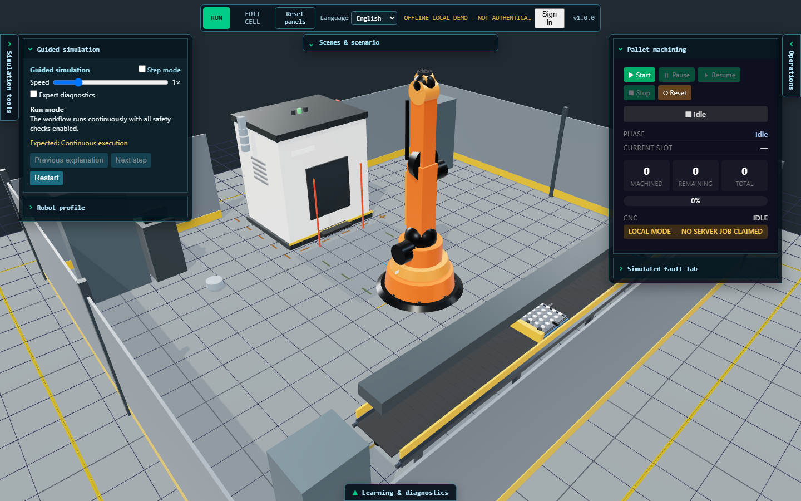
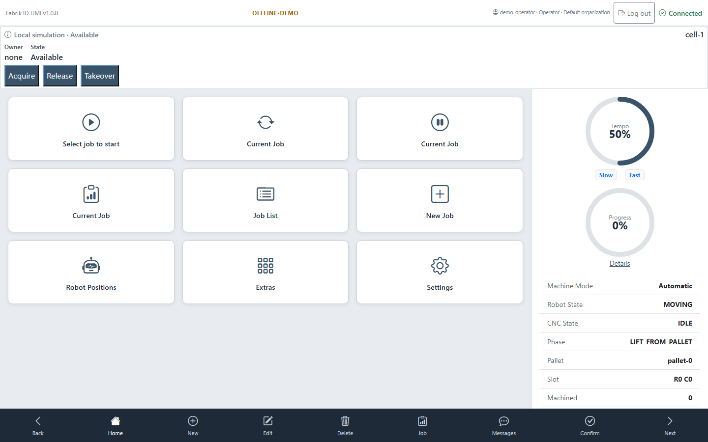
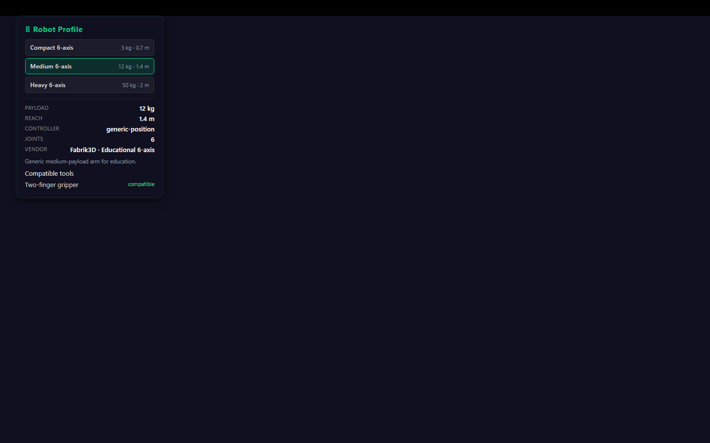
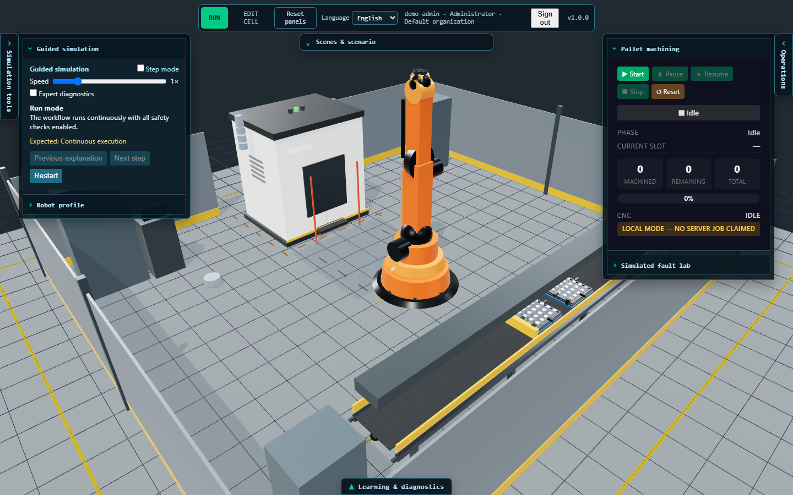
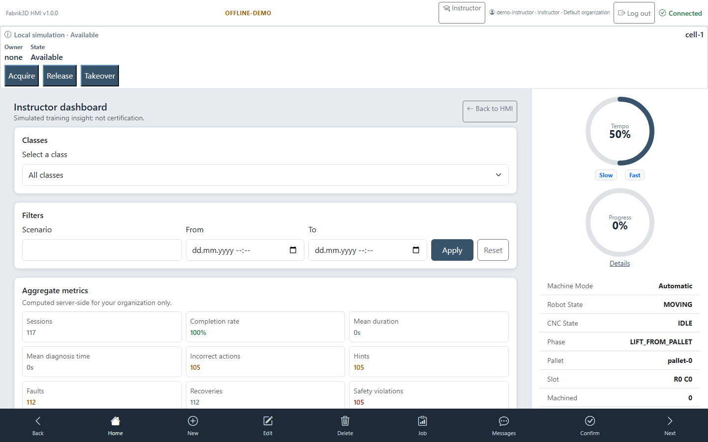
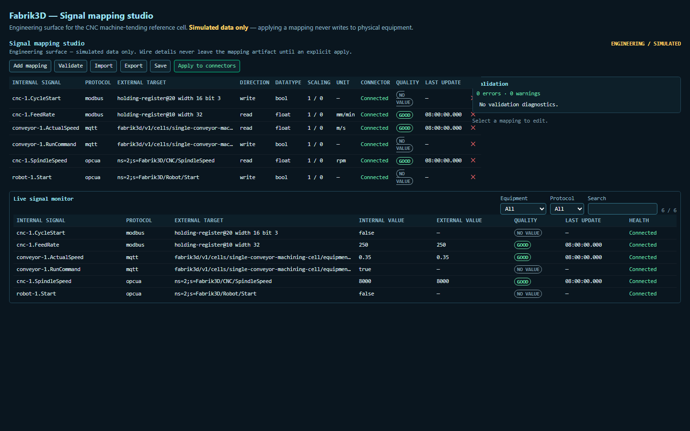
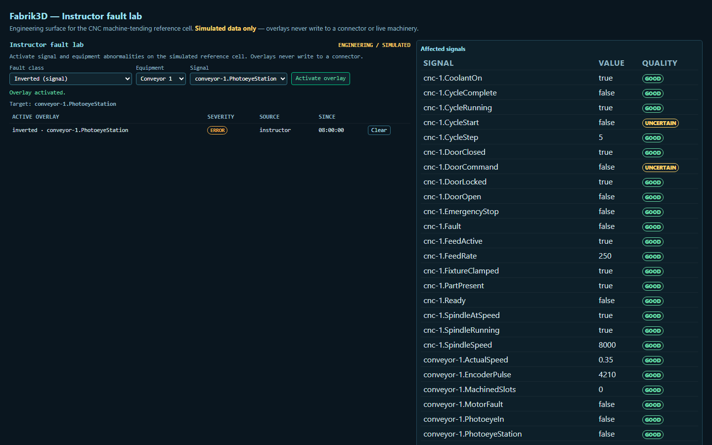
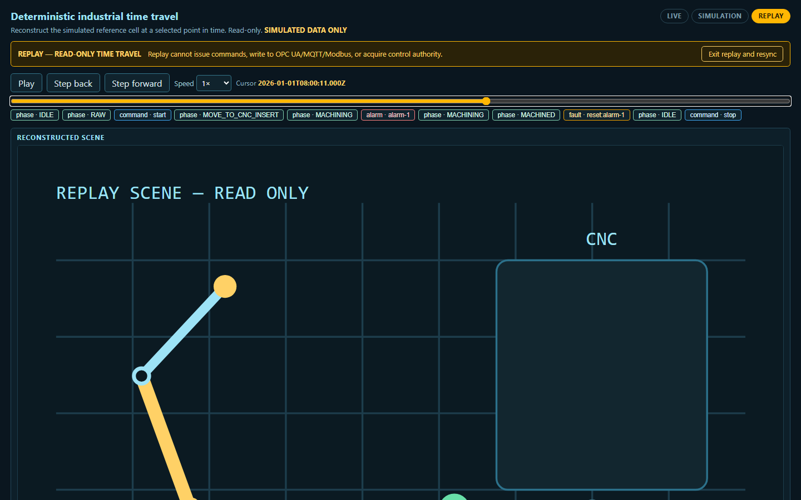
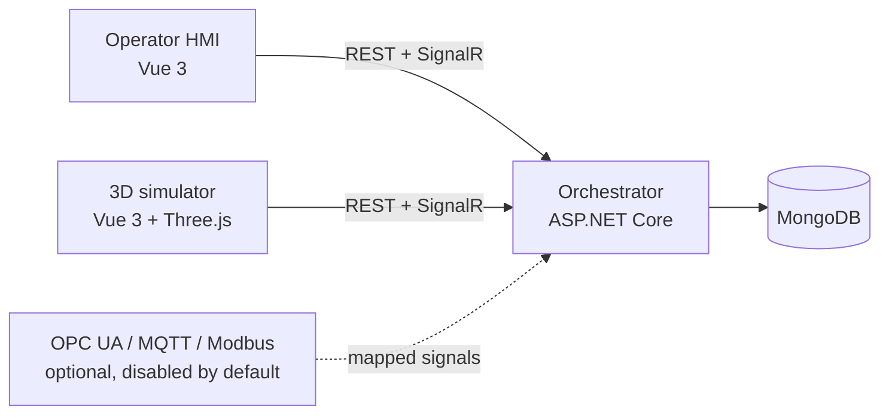

# Fabrik3DLite

[](https://github.com/VirgileDjimgou/Fabrik3DLite/actions/workflows/ci.yml)
[](https://github.com/VirgileDjimgou/Fabrik3DLite/actions/workflows/docker.yml)
[](https://dotnet.microsoft.com/)
[](https://nodejs.org/)
[](https://www.mongodb.com/)

Fabrik3DLite is an educational industrial simulation, training, digital-twin and lightweight
virtual-commissioning platform. It combines a Three.js robotic-cell simulator, an ASP.NET Core
orchestrator, MongoDB persistence and a dedicated Vue operator HMI.

The repository is at the **Fabrik3D 1.0 baseline (S50)**. It is suitable for learning, technical
demonstrations and prototyping; it is **not** a safety-certified control system, an exact OEM
emulator or a substitute for commissioning a physical cell.

## Try the live demo

| Surface | Link | Main use |
| --- | --- | --- |
| **3D simulator** | [fabrik3d.patrickdjimgou.dev](https://fabrik3d.patrickdjimgou.dev) | Run cells, scenarios, faults, signal tools and engineering views. |
| **Operator HMI** | [fabrik3d-hmi.patrickdjimgou.dev](https://fabrik3d-hmi.patrickdjimgou.dev) | Prepare jobs, supervise execution, alarms, messages and machine state. |

The public demo is a shared, resettable training environment hosted on Hetzner through Cloudflare
Tunnel. All equipment and production state are simulated. OPC UA, MQTT and Modbus TCP connectors
are implemented but disabled in the public deployment.

### Visual tour

<p align="center">
  
  
</p>

<p align="center">
  
  
  
</p>

<p align="center">
  
  
  
</p>

Short recordings: [guided scenario](./artifacts/demo/client/videos/02-scenario-lab.webm) ·
[mapping studio](./artifacts/demo/client/videos/04-mapping-studio.webm) ·
[fault lab](./artifacts/demo/client/videos/05-fault-lab.webm) ·
[time travel](./artifacts/demo/client/videos/06-time-travel.webm) ·
[authentication](./artifacts/demo/client/videos/08-simulator-auth.webm) ·
[instructor dashboard](./artifacts/demo/hmi/videos/03-instructor-dashboard.webm).
The [complete interactive gallery](./artifacts/demo/index.html) contains 28 screenshots and 11
Playwright-recorded videos captured against the live stack.

## What Fabrik3D can do today

| Area | Implemented capabilities |
| --- | --- |
| **3D cells and robots** | Five industrial scene presets; compact, medium and heavy generic six-axis robot profiles; FK/IK-oriented kinematics; frames; reachability; collision and swept-path checks; visual cell editor; portable versioned cell files. |
| **CNC reference cell** | Deterministic pallet feed, robot load/unload, CNC door/fixture/spindle/feed/coolant sequence, part return, safety interlocks and 54 live vendor-neutral signals. |
| **Learning** | Eleven guided scenarios, step mode, hints, deterministic scoring, local reports and server-assessed training sessions with audited instructor corrections. |
| **Faults and replay** | Seeded physical, equipment, communications and signal faults; acknowledgement/reset/retry workflow; event timeline; historian-backed read-only time travel with play, pause, step and event markers. |
| **Industrial I/O** | Typed signal registry, engineering inspector and versioned mapping studio for real optional OPC UA, MQTT and Modbus TCP clients. Writes are disabled by default and require an exact allow-list. |
| **External control** | Audited authority modes (`local-simulation`, `external-controller`, `observed-twin`, `replay`) and closed-loop showcase profiles for CODESYS/SoftPLC over Modbus TCP and Siemens S7-1500/PLCSIM Advanced over OPC UA. |
| **Operations** | Jobs, tasks, sessions, alarms, messages, templates, SignalR updates, health/readiness/version endpoints, OpenTelemetry-compatible metrics, secret-redacted support bundles, schema migrations, backup and restore. |
| **Training organizations** | Server-enforced authentication, roles, organizations, memberships, classes, resource assignments, tenant isolation and instructor aggregates. |
| **Deployment** | Hardened Docker Compose stack with `Production`, `OnPrem` and read-only `Demo` profiles, internal-only MongoDB, healthchecks, resource limits and fail-fast production configuration. |

The simulator can therefore model a complete nominal CNC tending cycle, abnormal recovery, safety
conditions, signal mapping, external-controller handover, classroom assessment and historical
analysis. Connectors can communicate with real endpoints only when an administrator explicitly
enables and allow-lists them; the hosted demo never writes to industrial machinery.

Detailed references: [release notes 1.0](./docs/releases/RELEASE_NOTES_1.0.md) ·
[architecture overview](./docs/architecture/OVERVIEW.md) ·
[documentation index](./docs/DOCUMENTATION_INDEX.md) ·
[1.0 sample project](./docs/samples/fabrik3d-1.0-reference-project/README.md).

## Profiles, identities and permissions

### Robot and deployment profiles

- Robot profiles are vendor-neutral **compact**, **medium** and **heavy** configurations with explicit
  reach, payload, joint, tool, kinematic and safety metadata. They do not claim OEM equivalence.
- `Production` is the hardened customer profile, `OnPrem` targets a training centre behind its own
  identity provider, and `Demo` is the public read-only profile with connectors disabled.
- `Development` and `Test` identities are limited to local development and CI. The server refuses to
  use them in Production, where an external OIDC authority is mandatory.

### Roles

Authorization is enforced by the server for REST and SignalR, not by hidden UI controls.

| Policy | Learner | Instructor | Engineer | Operator | Administrator |
| --- | :---: | :---: | :---: | :---: | :---: |
| Read | ✓ | ✓ | ✓ | ✓ | ✓ |
| Operate |  |  | ✓ | ✓ | ✓ |
| Train | ✓ | ✓ |  |  | ✓ |
| Engineer |  |  | ✓ |  | ✓ |
| Instruct |  | ✓ |  |  | ✓ |
| Admin |  |  |  |  | ✓ |

An optional `PublicDemo` identity grants read-only access for the clearly labelled hosted demo.
See [identity and RBAC](./docs/architecture/IDENTITY_AND_RBAC.md),
[organizations and tenancy](./docs/architecture/ORGANIZATIONS_AND_TENANCY.md) and the
[instructor guide](./docs/guides/INSTRUCTOR_GUIDE.md).

## Architecture


```mermaid
flowchart LR
    HMI["Operator HMI\nVue 3"] -->|REST + SignalR| API["Orchestrator\nASP.NET Core"]
    SIM["3D simulator\nVue 3 + Three.js"] -->|REST + SignalR| API
    API --> DB[(MongoDB)]
    PLC["OPC UA / MQTT / Modbus\noptional, disabled by default"] -. mapped signals .-> API
```

The server is the orchestration source of truth, the simulator executes and visualizes the cell, and
the HMI remains the operator surface. Definition, runtime, visual, collision and telemetry models are
kept separate.

## Run locally

Prerequisites: .NET 8 SDK, Node.js 20.19+ or 22.12+, and MongoDB at
`mongodb://localhost:27017`.

```powershell
# Terminal 1 — API and Swagger
dotnet run --project Fabrik3D/Fabrik3D.Server

# Terminal 2 — 3D simulator
npm --prefix Fabrik3D/fabrik3d.client install
npm --prefix Fabrik3D/fabrik3d.client run dev

# Terminal 3 — operator HMI
npm --prefix Fabrik3D/fabrik3d.hmi install
npm --prefix Fabrik3D/fabrik3d.hmi run dev
```

See [local setup](./docs/development/SETUP.md) for identity settings and URLs, or use the production-
style Compose stack:

```bash
docker compose -f Fabrik3D/compose.production.yaml config --quiet
node scripts/lifecycle/verify-config.mjs

# Copy the non-secret template outside the repository and provide the required OIDC values.
sudo install -d -m 700 /etc/fabrik3d
sudo cp Fabrik3D/env/onprem.env.example /etc/fabrik3d/onprem.env
sudo chmod 600 /etc/fabrik3d/onprem.env

FABRIK3D_ENV_FILE=/etc/fabrik3d/onprem.env \
  docker compose -f Fabrik3D/compose.production.yaml up --build -d
```

| Service | Default URL | Notes |
| --- | --- | --- |
| Simulator | `http://localhost:8081` | Nginx frontend |
| Operator HMI | `http://localhost:8082` | Nginx frontend |
| API | `http://localhost:8080` | `/api/health/ready`, `/api/version` |
| MongoDB | internal only | Never published by the production Compose file |

## Deploy on Hetzner through Cloudflare Tunnel

The following is the configuration pattern used by the public demo. It exposes the web surfaces
through Cloudflare Tunnel without opening application ports on the Hetzner firewall. This repository
does **not** contain a deployment workflow that automatically changes production infrastructure.

### 1. Keep credentials outside Git

| Credential | Safe location |
| --- | --- |
| Hetzner SSH **private** key | Operator workstation SSH agent or password manager; upload only the public key to Hetzner. |
| `CLOUDFLARE_TUNNEL_TOKEN` | Root-readable server environment file (`0600`), systemd credential or external secret manager. |
| Cloudflare API token, if DNS automation is added | CI/provider secret store only; use the narrowest zone permissions. |
| OIDC client secret and connector credentials | `/etc/fabrik3d/*.env` (`0600`) or a deployment secret manager. |

Never paste real keys or tokens into this README, an issue, a commit, a Compose file or a shell history.
The repository security hook rejects credential-shaped content.

### 2. Connect and start the stack

```powershell
# Workstation: this variable is a local file path, never the private-key content.
$env:HETZNER_HOST = "<server-ip-or-dns>"
$env:HETZNER_USER = "<non-root-deploy-user>"
$env:HETZNER_SSH_KEY_PATH = "$env:USERPROFILE\.ssh\fabrik3d_hetzner"
ssh -i $env:HETZNER_SSH_KEY_PATH "$env:HETZNER_USER@$env:HETZNER_HOST"
```

```bash
# Hetzner host: Docker Engine 24+ and Compose v2 are expected.
git clone https://github.com/VirgileDjimgou/Fabrik3DLite.git
cd Fabrik3DLite

sudo install -d -m 700 /etc/fabrik3d
sudo cp Fabrik3D/env/demo.env.example /etc/fabrik3d/demo.env
sudo chmod 600 /etc/fabrik3d/demo.env
sudoedit /etc/fabrik3d/demo.env  # configure origins/OIDC; do not commit this file

FABRIK3D_PROFILE=Demo FABRIK3D_ENV_FILE=/etc/fabrik3d/demo.env \
  docker compose -f Fabrik3D/compose.production.yaml up -d --build

curl --fail http://127.0.0.1:8080/api/health/ready
curl --fail http://127.0.0.1:8080/api/version
```

### 3. Configure Cloudflare Tunnel

Create the tunnel in Cloudflare Zero Trust, keep its token in the server secret store, and configure
these public-hostname routes in the dashboard or in the tunnel configuration:

```yaml
ingress:
  - hostname: fabrik3d.<your-domain>
    service: http://127.0.0.1:8081
  - hostname: fabrik3d-hmi.<your-domain>
    service: http://127.0.0.1:8082
  - service: http_status:404
```

Run `cloudflared` as a managed service with automatic restart. If testing interactively, load the
token from the protected environment rather than typing it into the command:

```bash
sudo install -m 600 /dev/null /etc/fabrik3d/cloudflared.env
sudoedit /etc/fabrik3d/cloudflared.env  # add the tunnel token from Cloudflare Zero Trust

set -a
. /etc/fabrik3d/cloudflared.env  # mode 0600; contains CLOUDFLARE_TUNNEL_TOKEN
set +a
cloudflared tunnel --no-autoupdate run --token "$CLOUDFLARE_TUNNEL_TOKEN"
```

Restrict inbound Hetzner traffic to SSH from trusted administration addresses; the tunnel creates the
outbound application connection. Rotate a leaked key/token immediately, then restart `cloudflared`
and recreate affected containers. Full procedures are in the
[deployment](./docs/operations/DEPLOYMENT.md),
[security hardening](./docs/operations/SECURITY_HARDENING.md),
[backup/restore](./docs/operations/BACKUP_RESTORE.md) and
[upgrade/rollback](./docs/operations/UPGRADE_ROLLBACK.md) guides.

## Verification

```powershell
npm run docs:check
npm run contracts:check
npm run type-check
npm --prefix Fabrik3D/fabrik3d.client run test
npm --prefix Fabrik3D/fabrik3d.client run test:visual
npm --prefix Fabrik3D/fabrik3d.hmi run test
dotnet test Fabrik3D/Fabrik3D.slnx --no-build
npm run security:scan
```

See [TESTING.md](./docs/TESTING.md) for the complete test matrix and recorded validation scope.

## Boundaries

- Faults, safety conditions, learning data and hosted cell behaviour are simulated.
- Safety visuals and motion guards are teaching aids, not certified safety functions.
- Replay cannot acquire control authority or write to a connector.
- OPC UA, MQTT and Modbus TCP writes require explicit enablement, a writable mapping and an exact
  allow-list; protocol support is not a conformance certification.
- CODESYS and Siemens profiles are documented interoperability showcases, not vendor partnerships;
  proprietary projects, licenses and binaries are not included.
- Production requires an external OIDC provider and fail-closed configuration.

Start with the [documentation index](./docs/DOCUMENTATION_INDEX.md), the audience guides for
[learners](./docs/guides/LEARNER_QUICKSTART.md),
[instructors](./docs/guides/INSTRUCTOR_GUIDE.md) and
[external controllers](./docs/guides/EXTERNAL_CONTROLLER_GUIDE.md), and the explicit
[limitations and non-claims](./docs/operations/LIMITATIONS.md).
