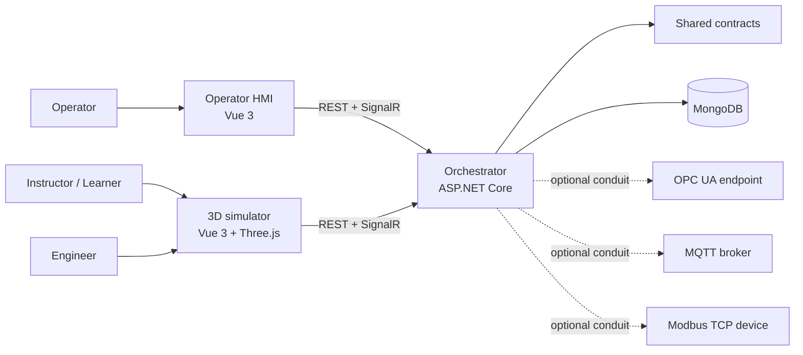

# Fabrik3D architecture overview

Status: **implemented** for the S01-S50 feature set, documented at the 1.0 baseline.

This document is the single-page map of the platform. It states what each component owns, which
boundaries are load-bearing, and how the pieces talk to each other. Detailed contracts live in the
per-topic architecture documents linked throughout and indexed in
[`docs/DOCUMENTATION_INDEX.md`](../DOCUMENTATION_INDEX.md).

Fabrik3D is an educational industrial-software demonstrator for designing, simulating, supervising
and understanding a robotic cell. It is **not** a safety-certified control system, an OEM robot
emulator, or a substitute for commissioning a physical cell. All fault, safety and learning data is
explicitly simulated unless a documented connector is deliberately enabled against a real endpoint.

## System context

The **orchestrator is the single source of orchestration truth**. The simulator executes and
visualizes the simulated cell; the HMI is the operator interface. Neither client is trusted for
authorization, scoring or tenancy.

## Components and responsibilities

| Component | Location | Owns |
| --- | --- | --- |
| Orchestrator (server) | `Fabrik3D/Fabrik3D.Server` | Jobs, tasks, sessions, machine state, alarms, messages, cell templates, control authority, historian ingestion/queries, training sessions, diagnostics, authentication/tenancy enforcement, connector hosting. |
| Domain | `Fabrik3D/Fabrik3D.Domain` | Entities, value objects and transition/authority rules. Protocol-free: no OPC UA/MQTT/Modbus type or address appears here. |
| Infrastructure | `Fabrik3D/Fabrik3D.Infrastructure` | MongoDB persistence, migrations, and the optional OPC UA / MQTT / Modbus adapters plus the protocol-free C# signal mirror. |
| Contracts | `Fabrik3D/Fabrik3D.Contracts` | DTOs and the generated TypeScript contract source (`Fabrik3D/fabrik3d-ts-contracts`). |
| 3D simulator | `Fabrik3D/fabrik3d.client` | Three.js reference cell, scene presets, cell editor, scenarios/step mode, kinematics and safety checks, fault lab, signal inspector, mapping studio, time travel, learning reports. |
| Operator HMI | `Fabrik3D/fabrik3d.hmi` | Touch-oriented operator surface: home, jobs, current job, alarms, messages, settings, instructor dashboard, control-authority indicator. |
| Test fixtures | `Fabrik3D/Fabrik3D.Modbus.Fixture`, `Fabrik3D/Fabrik3D.OpcUa.Fixture` | In-process real Modbus TCP / OPC UA servers used by automated connector tests (no Docker, no proprietary software). |

## Load-bearing boundaries

- **Definition ≠ Runtime ≠ Visual ≠ Collision ≠ Telemetry.** A cell *definition* (versioned data)
  never implies runtime behavior; visual meshes are replaceable and are never the collision or
  orchestration source of truth. Collision proxies are deterministic and separate from visuals, and
  telemetry is a time-stamped observation, not a command.
- **Protocols are optional adapters.** No protocol type, node id or register address leaks into the
  domain. Adapters project into the protocol-free signal mirror and obey fail-closed write policy.
- **Replay is read-only.** Reconstructed state can never acquire control authority or emit a
  protocol write (`docs/adr/0002-time-travel-read-only-reconstruction.md`).
- **Authority is exclusive.** Exactly one control authority owns a scope at a time; handover is
  explicit, precondition-checked, audited and visible (`docs/architecture/CONTROL_AUTHORITY.md`).
- **Authorization is server-side.** Hidden UI is never a control; tenant scoping happens in
  repositories/queries, never by client filtering.

## Data and state flow

1. The operator (or a script) prepares a job through the HMI or REST; jobs may carry pallet-slot
   tasks. The server persists the job.
2. A simulator claims a runnable job (`POST /api/jobs/{id}/claim`); only the claiming simulator may
   update its tasks, session, heartbeat and machine state. An unowned simulator runs an explicitly
   labelled local-only demo and writes nothing.
3. The reference cell publishes 54 vendor-neutral signals (robot, CNC, conveyor, safety). Command
   signals drive the same workflow, CNC, conveyor and interlock paths as the operator controls, and
   status signals are derived from real runtime state. Fault overlays are applied on publish and can
   refuse commands without mutating canonical definitions.
4. The HMI observes changes live through SignalR (`/hubs/orchestration`) and issues confirm-guarded
   commands.
5. Optional conduits map internal signals to OPC UA/MQTT/Modbus targets. Writes require enablement
   **and** an exact allow-list match; replay and unauthorized authority fail closed.
6. The historian stores bounded, sampled telemetry and events; time travel folds a historian window
   or the local timeline into a read-only snapshot for inspection.

## Cross-cutting concerns

| Concern | Implementation | Document |
| --- | --- | --- |
| Identity, RBAC | JWT/OIDC, named policies, dev/test mode refused in Production | [IDENTITY_AND_RBAC.md](IDENTITY_AND_RBAC.md), [ADR 0003](../adr/0003-identity-and-rbac.md) |
| Tenancy | Server-resolved organization context, filtered queries, non-leaking rejection | [ORGANIZATIONS_AND_TENANCY.md](ORGANIZATIONS_AND_TENANCY.md) |
| Signals | Versioned typed signal core + reference-cell binding | [INDUSTRIAL_SIGNAL_CORE.md](INDUSTRIAL_SIGNAL_CORE.md), [REFERENCE_SIGNAL_CATALOG.md](REFERENCE_SIGNAL_CATALOG.md) |
| Connectors | Disabled-by-default OPC UA/MQTT/Modbus adapters | [OPC_UA_ADAPTER.md](OPC_UA_ADAPTER.md), [MQTT_SHOWCASE.md](MQTT_SHOWCASE.md), [MODBUS_TCP_ADAPTER.md](MODBUS_TCP_ADAPTER.md) |
| Authority | Exclusive, audited arbitration | [CONTROL_AUTHORITY.md](CONTROL_AUTHORITY.md) |
| Faults | Simulated overlays, no connector writes | [FAULT_LAB.md](FAULT_LAB.md), [FAULTS_TIMELINE_REPLAY.md](FAULTS_TIMELINE_REPLAY.md) |
| Historian | Bounded retention, read-only queries | [TELEMETRY_HISTORIAN.md](TELEMETRY_HISTORIAN.md) |
| Time travel | Deterministic read-only reconstruction | [TIME_TRAVEL.md](TIME_TRAVEL.md) |
| Training | Server-assessed sessions and reports | [TRAINING_SESSIONS.md](TRAINING_SESSIONS.md), [INSTRUCTOR_DASHBOARD.md](INSTRUCTOR_DASHBOARD.md) |
| Observability | Traces/metrics/logs, export off by default | [../operations/OBSERVABILITY.md](../operations/OBSERVABILITY.md) |
| Deployment | Hardened compose stack, profiles, backup/restore | [../operations/DEPLOYMENT.md](../operations/DEPLOYMENT.md), [ADR 0006](../adr/0006-on-premise-deployment-and-migration.md) |
| Security | OWASP-aligned controls; IEC 62443-inspired zones | [../operations/SECURITY_MODEL.md](../operations/SECURITY_MODEL.md), [../operations/SECURITY_HARDENING.md](../operations/SECURITY_HARDENING.md) |

## Maturity labels

Fabrik3D distinguishes the following, and every document and claim uses them consistently:

- **Implemented / real** — built and covered by automated tests (e.g. the ASP.NET Core orchestrator,
  the real OPC UA/MQTT/Modbus clients, the historian, RBAC).
- **Simulated** — the modeled machine, faults, safety conditions, signals and learning data. Always
  labelled as training data; never presented as physical-machine data.
- **Experimental** — available behind an explicit opt-in and documented as such (for example
  development certificate auto-accept for a lab OPC UA endpoint).
- **Planned / out of scope** — not built; recorded in [LIMITATIONS.md](../operations/LIMITATIONS.md).

No safety certification, OEM emulation or standards compliance is claimed anywhere. Standards
language uses "inspired by", "aligned with selected concepts" or "designed around".

## Where to start

- New user: [Learner quick start](../guides/LEARNER_QUICKSTART.md) and the
  [1.0 reference sample project](../samples/fabrik3d-1.0-reference-project/README.md).
- Instructor: [Instructor guide](../guides/INSTRUCTOR_GUIDE.md).
- Administrator: [Administrator guide](../operations/ADMINISTRATOR_GUIDE.md).
- Integrator: [External controller guide](../guides/EXTERNAL_CONTROLLER_GUIDE.md) and
  [Signal mapping guide](../guides/SIGNAL_MAPPING_GUIDE.md).
- Full list: [Documentation index](../DOCUMENTATION_INDEX.md).
