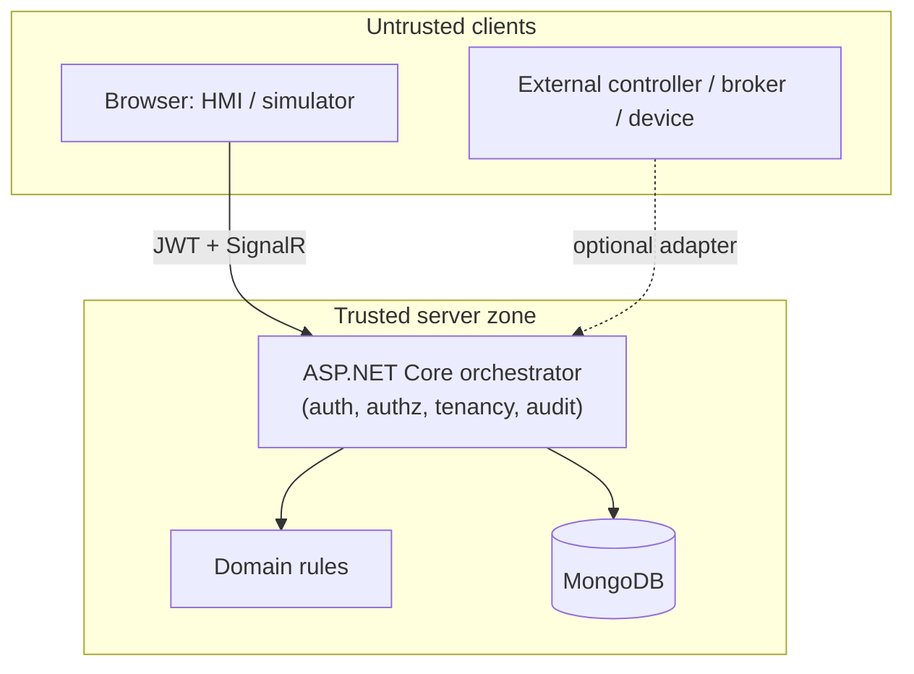

# Security model

Status: 1.0 baseline. This document is the **conceptual** security model: assets, trust boundaries,
identities, authorization and threat assumptions. The executed controls, fail-closed behaviour and
test evidence are in [SECURITY_HARDENING.md](SECURITY_HARDENING.md). Fabrik3D is aligned with
selected OWASP secure ASP.NET Core practices and inspired by IEC 62443 zone/conduit concepts applied
to connector boundaries. It is **not certified** and no penetration test has been performed.

## Assets

| Asset | Why it matters |
| --- | --- |
| Job/task/session state | Drives the simulated cell; incorrect writes corrupt a run. |
| Control authority | Exactly one owner per actuator scope; concurrent ownership is a safety/VC concern. |
| Connector write capability | The only path that can affect an external endpoint. |
| Training records and scores | Learner data; must be tenant-scoped and trustworthy. |
| Historian telemetry/events | Operational history; read-only to consumers. |
| Secrets (OIDC keys, connector credentials) | Never logged or committed; redacted in support bundles. |
| Audit records | Prove who did what, when. |

## Trust boundaries

- **Zone 1 (control)** — the orchestrator and domain own all authoritative state, authorization and
  audit. They are the only components allowed to decide.
- **Clients are untrusted.** Hiding a UI control is never a control; every mutating endpoint and hub
  method enforces authorization server-side.
- **Conduits are optional and isolated.** Each protocol adapter is a conduit. No protocol type,
  node id or register address leaks into the domain. Adapters are disabled by default.
- **Store** — MongoDB is internal-only in the production compose stack and never published.

## Identities and subjects

- Users authenticate with JWT bearer tokens. Production uses an external OIDC provider; a
  clearly-labelled, rate-limited `Development`/`Test` mode exists for local/CI/demo and is **refused
  in Production** (`AuthenticationStartupGuard`).
- Roles: Learner, Instructor, Engineer, Operator, Administrator, plus an opt-in read-only PublicDemo.
  Named policies (`Read`, `Operate`, `Train`, `Engineer`, `Instruct`, `Admin`) map to endpoints.
- External controllers are **not** users. They are constrained by the connector write policy and by
  control authority, not by a user role.
- Audit records carry the authenticated subject and, where applicable, the organization.

## Authorization and tenancy

- Every mutating REST endpoint and SignalR hub method is authorized server-side.
- Tenant context is resolved from a validated membership; a client-supplied `X-Organization-Id` is
  never trusted. Cross-organization object ids behave as `404` without leaking existence.
- The public demo is read-only for anonymous visitors except where a labelled dev/test identity is
  provided for demonstration.

## Data classes and handling

- **Secrets** — externalized via env files/Docker secrets, never committed, never logged. Support
  bundles are secret-redacted and scoped to owned configuration sections.
- **Operational data** — jobs, tasks, sessions, alarms, messages, telemetry, events, training
  records; tenant-scoped and audited. See [DATA_AND_PRIVACY.md](DATA_AND_PRIVACY.md).
- **Tokens** — never placed in URLs (except the SignalR hub query parameter, which is never logged).

## Threat assumptions and mitigations

| Threat | Mitigation | Evidence |
| --- | --- | --- |
| Anonymous/unauthorized mutation | Server-side `[Authorize]`/policies; negative test matrix | IDENTITY_AND_RBAC, SecurityHardeningTests |
| Cross-tenant data access | Server-resolved org context, repository filters, non-leaking 404 | ORGANIZATIONS_AND_TENANCY |
| Malicious connector write | Disabled by default; enable + `AllowWrites` + exact allow-list + writable signal | OPC UA/MQTT/Modbus docs, connector tests |
| Certificate spoofing | Trust-store validation; no silent accept; explicit dev opt-in | OPC_UA_ADAPTER, connector tests |
| Replay/authority abuse | Replay read-only; exclusive authority; audited handover | CONTROL_AUTHORITY, ADR 0002 |
| Oversized/malformed upload | Bounded validation before parsing; path/traversal checks | SECURITY_HARDENING |
| Brute force / abuse | Rate limiting on auth and sensitive surfaces; explicit-origin CORS; security headers | SECURITY_HARDENING |
| Secret leakage | Redaction; env/secret externalization; scans | SecretRedactor, `npm run security:scan` |

## Fail-closed principles

- Connector disabled, writes disabled, or signal not allow-listed → write refused with an explicit
  reason; no protocol write is emitted.
- Insecure/unknown production identity or deployment configuration → startup fails fast with every
  actionable problem listed.
- Cross-organization access → rejected without leaking existence.
- Oversized/malformed input → rejected before expensive parsing; nothing persisted.
- Observability exporter unavailable → application continues; the request path never depends on it.

A surface-by-surface threat model with mitigations and an accepted residual-risk register is in
[THREAT_MODEL.md](THREAT_MODEL.md).

## Out of scope / residual risk

- No independent security review, penetration test or compliance certification. The
  [threat model](THREAT_MODEL.md) is a lightweight internal review, not a certification.
- No certificate pinning of external endpoints.
- Browsers reach the API over TLS terminated at the deployment proxy/tunnel; HSTS is a deployment
  decision.
- The public demo's shared, permissive dev/test identity is a demonstration aid, not a security
  boundary; Production refuses it.

## Related documents

- [Security hardening and evidence](SECURITY_HARDENING.md)
- [Identity and RBAC](../architecture/IDENTITY_AND_RBAC.md)
- [Organizations and tenancy](../architecture/ORGANIZATIONS_AND_TENANCY.md)
- [Control authority](../architecture/CONTROL_AUTHORITY.md)
- [Data and privacy](DATA_AND_PRIVACY.md)
- [Limitations](LIMITATIONS.md)
