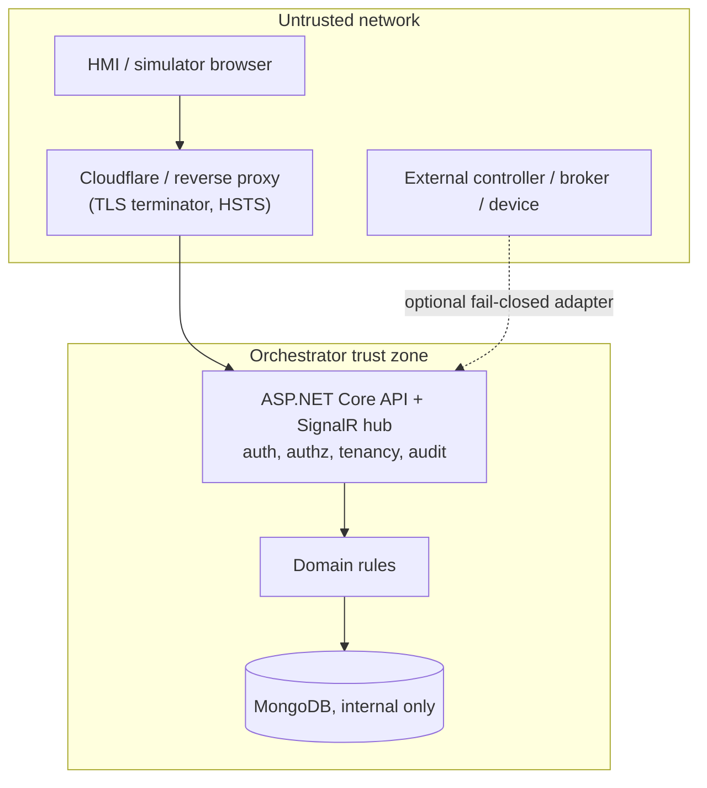

# Threat model

Status: **reviewed and implemented (S57)**. This is an evidence-based, lightweight threat model for
the Fabrik3D 1.0 surfaces. It records assets, trust boundaries, entry points, threats, existing
mitigations and accepted residual risk. It is **not** an IEC 62443/OWASP certification, and no
penetration test has been performed. It complements the conceptual
[security model](SECURITY_MODEL.md) and the executed [security hardening](SECURITY_HARDENING.md).

Method: enumerate the reachable surfaces, mark the trust boundary they cross, list the realistic
threats, map each to an implemented mitigation with a test reference, and record what is deliberately
left as residual risk with an owner and a rationale.

## Assets

| Asset | Why it matters |
| --- | --- |
| Job/task/session state | Drives the simulated cell; unauthorized writes corrupt a run. |
| Control authority | Exactly one owner per actuator scope; concurrent ownership is a safety concern. |
| Connector write capability | The only path that can affect an external endpoint. |
| Training records/scores | Learner data; tenant-scoped and trustworthy. |
| Historian telemetry/events | Operational history; read-only to consumers. |
| Signal mappings | Can influence connector behaviour; tenant-scoped engineering data. |
| Secrets (OIDC keys, Mongo/tunnel/MQTT credentials, OPC UA certificates) | Never committed, logged or bundled. |
| Audit trail and support artifacts | Prove who did what and support diagnosis without leaking. |

## Trust boundaries and entry points

| Entry point | Boundary | Notes |
| --- | --- | --- |
| REST API (`/api/**`) | Untrusted → server | JWT bearer; named policies per endpoint. |
| SignalR hub (`/hubs/orchestration`) | Untrusted → server | Same JWT via `access_token` query param; Read policy. |
| Static client/HMI assets | Untrusted → server | Served by the host/reverse proxy; CSP and frame policy apply. |
| OPC UA / MQTT / Modbus adapters | Server → external device | Optional, disabled by default, write fail-closed. |
| Asset/cell/mapping import | Untrusted → server | Bounded validation before parsing; paths confined. |
| Historian ingest/query | Untrusted → store | Authenticated, rate-limited, tenant-scoped. |
| Support bundle / diagnostics | Admin/Read → operator | Redacted, allow-listed configuration sections. |

## Threats and mitigations

| Surface | Threat | Mitigation | Evidence |
| --- | --- | --- | --- |
| HMI | Hidden-control bypass, tampering with operator actions | Server-side authorization on every mutating endpoint; target shown before critical actions | `EndpointAuthorizationTests`, `SecurityHeadersTests` |
| Simulator | Spoofed or replayed execution/jog commands | Targeted SignalR groups, control authority, dead-man, simulator-side safety | `HubTargetingTests`, `ControlAuthorityIntegrationTests`, `RobotJogAuthorityIntegrationTests` |
| Orchestrator | Unauthorized state mutation, unsafe startup config | Policy guards, fail-fast `DeploymentConfigurationValidator`, fail-closed defaults | `DeploymentConfigurationValidatorTests`, `SecurityHeaderPolicyTests` |
| OIDC / identity | Dev identity in production, token forgery/replay | External OIDC in Production; dev/test mode refused in Production; issuer/audience/lifetime validation | `AuthenticationStartupGuard`, `EndpointAuthorizationTests`, `IdentityPolicyTests` |
| MongoDB | External exposure, credential leakage | Internal-only in the production compose; credentials via env/secrets; support bundle redaction | `compose.production.yaml`, `SupportBundleBuilderTests` |
| SignalR | Cross-tenant event exposure, unauthorized hub use | Read-authorized hub; targeted `simulator:{id}` groups for dispatch/jog; broadcast events scoped to a single-cell deployment | `HubTargetingTests`, `EndpointAuthorizationTests` |
| OPC UA | Spoofed server, prohibited write | Trust-store validation, no silent accept, explicit dev opt-in; write requires enable + allow-list + writable signal | `OpcUaConnectorIntegrationTests`, `SecurityHardeningTests` |
| MQTT | Forged command, retained replay, untrusted broker | Command allow-list, retained-command opt-in, timestamp freshness, no untrusted certs | `MqttConnectorIntegrationTests` |
| Modbus | Out-of-range write, malformed frame | Write allow-list, address/type validation, bounded frame handling | `ModbusConnectorIntegrationTests`, `ModbusMappingValidationTests` |
| Asset/cell/mapping import | Path traversal, oversized content, undeclared members | Package-relative paths only, bounded sizes, declared files, schema-versioned JSON | `AssetPackageImporter.test.ts`, `CellFileContentValidatorTests` |
| Historian | Cross-tenant read, data injection, unbounded growth | Tenant-scoped repository, bounded/rate-limited ingest, read-time staleness, retention caps | `CrossTenantHistorianTests`, `HistorianIntegrationTests` |
| Tenancy | Cross-organization observe/mutate | Server-resolved membership; repository-level filters; non-leaking 404 | `CrossTenantNegativeMatrixTests`, `TenancyHttpIntegrationTests`, `TenantScopeTests` |
| Support bundle | Secret/PII leakage | Owned configuration sections only; `SecretRedactor`; admin-only endpoint | `SupportBundleBuilderTests`, `SecretRedactorTests` |
| Cloudflare / reverse proxy | Missing TLS/HSTS/CSP, header that breaks SignalR | Documented proxy guidance; `ExternalTls` startup validation; reviewed CSP keeps `connect-src 'self' ws: wss:`, wasm and blob workers | `SecurityHeaderPolicyTests`, [DEPLOYMENT.md](DEPLOYMENT.md) |

## Repository and supply chain

- Binary/repository lifecycle is enforced by `npm run repo:policy` (build output, dependencies,
  temporary archives and oversized binaries), grandfathering pre-existing blobs through a frozen,
  provenance-recorded baseline without rewriting history. See [REPOSITORY_POLICY.md](REPOSITORY_POLICY.md).
- `npm run audit` (npm + NuGet) and `npm run security:scan` (tracked-file secret patterns) run as
  gates. `npm run security:scan` also flags sensitive filenames.

## Residual risk register

| # | Residual risk | Owner | Rationale / status |
| --- | --- | --- | --- |
| R1 | No formal threat-model review by an external security team, penetration test or standards certification | Product/security | Out of scope for S57; statements are limited to implemented controls and tests. |
| R2 | Generic SignalR broadcasts (`JobStateChanged`, `MachineStateChanged`, …) are deployment-wide rather than per-organization in multi-organization mode | Backend | Accepted: the supported single-cell topology isolates tenants at the deployment/proxy boundary; per-event organization routing is tracked as follow-up work. Targeted dispatch/jog events are already group-scoped. |
| R3 | HSTS is not asserted by default; the TLS terminator must set it | Operations | Documented; `SecurityHeaders:ExternalTls=true` makes a missing HSTS/CSP fail startup. |
| R4 | Signal mapping store is in-memory and per-process; tenant partitioning is enforced in-process | Backend | Accepted until a persisted mapping store exists; no cross-tenant read/mutation is possible within a process. |
| R5 | No certificate pinning of external industrial endpoints | Integrations | Trust-store validation and explicit dev trust are implemented; pinning is follow-up. |
| R6 | Dependency audit results reflect public vulnerability databases at execution time | Release | Rerun on every release; no scanner is hidden or skipped. |

## Repository lifecycle note

Removing grandfathered large history blobs is a separate, explicit **HUMAN_REQUIRED** migration and is
never performed automatically by sprint automation (see [REPOSITORY_POLICY.md](REPOSITORY_POLICY.md)).

## Related documents

- [Security model](SECURITY_MODEL.md)
- [Security hardening and evidence](SECURITY_HARDENING.md)
- [Repository and binary policy](REPOSITORY_POLICY.md)
- [Deployment](DEPLOYMENT.md)
- [Support bundle](SUPPORT_BUNDLE.md)
- [Identity and RBAC](../architecture/IDENTITY_AND_RBAC.md)
- [Organizations and tenancy](../architecture/ORGANIZATIONS_AND_TENANCY.md)
